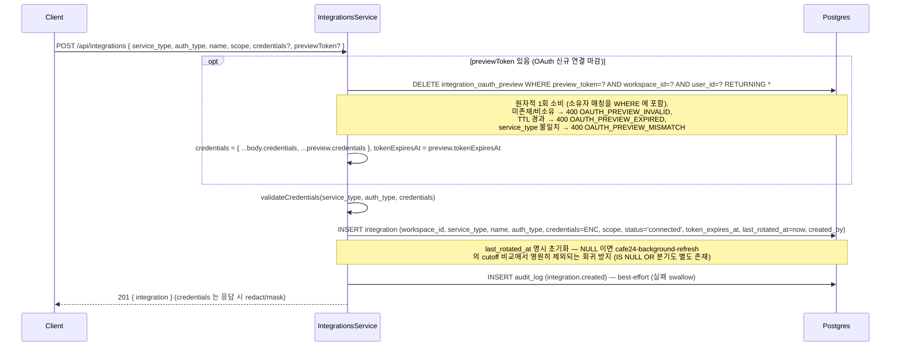
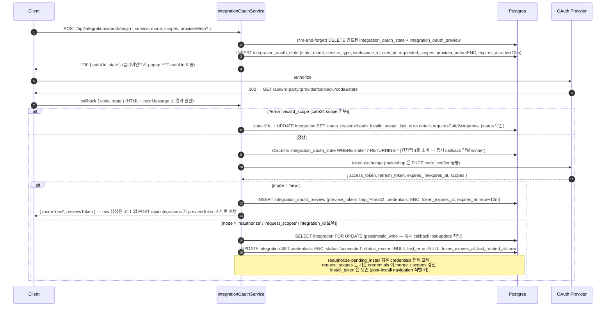
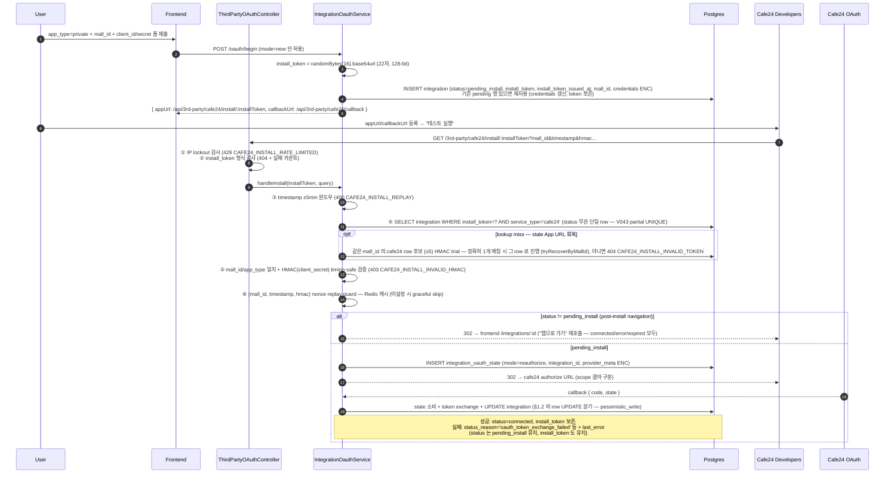
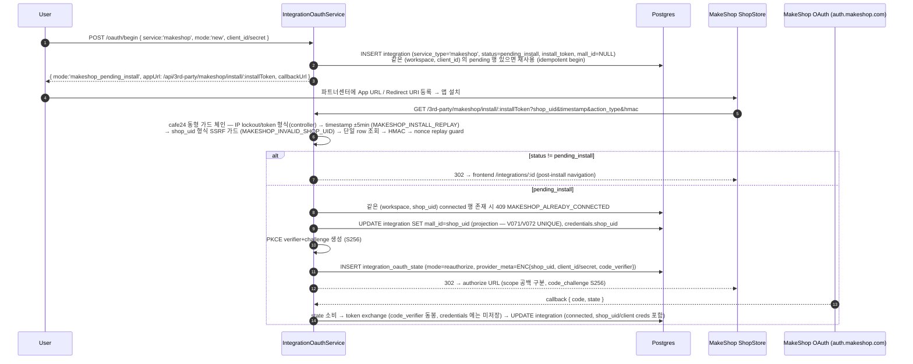
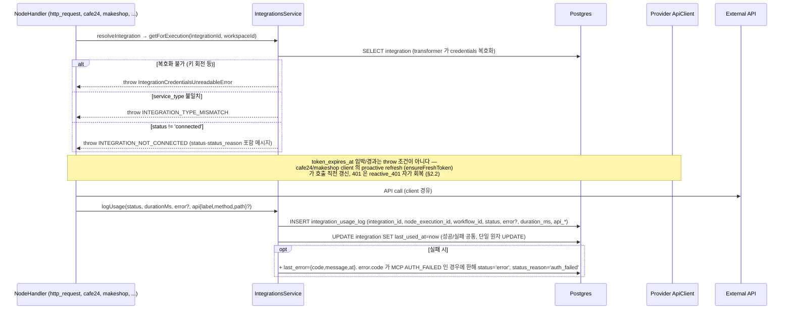
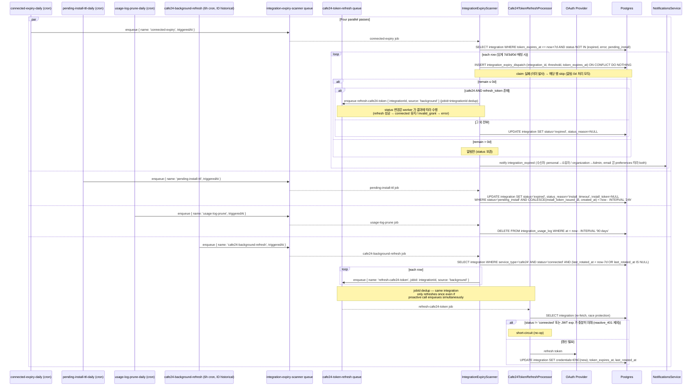
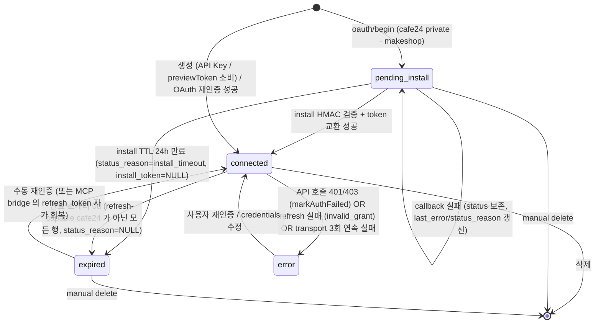

# Data Flow: 외부 통합 (Integration)

> 관련 spec: [Spec 통합 화면](../2-navigation/4-integration.md) · [데이터 모델 §2.10, §2.10.1](../1-data-model.md) · [Cafe24 노드](../4-nodes/4-integration/4-cafe24.md) · [MakeShop 노드](../4-nodes/4-integration/5-makeshop.md) · [data-flow 개요](./0-overview.md)

---

## Overview

### System role

외부 SaaS (Google·GitHub·Cafe24·MakeShop 등) 와 통신하기 위한 인증 정보·연결 상태를 저장한다. 노드 실행
시점에 해당 integration 의 credentials 를 가져와 외부 API 호출에 사용하고, 호출 결과는 `integration_usage_log`
에 기록한다. OAuth 토큰은 별도 만료 스캐너가 주기적으로 점검해 알림을 발사하고, refresh 가능 provider 는
전용 refresh 큐로 갱신하며 그 외는 `expired` 로 마킹한다.

코드 진입점:

- `codebase/backend/src/modules/integrations/integrations.service.ts` — CRUD · previewToken 소비 · usage log
- `codebase/backend/src/modules/integrations/integration-oauth.service.ts` — OAuth begin / callback / install (cafe24·makeshop)
- `codebase/backend/src/modules/integrations/third-party-oauth.controller.ts` — `/api/3rd-party/**` install·callback 엔드포인트 (rate limit 포함)
- `codebase/backend/src/modules/integrations/integration-expiry-scanner.service.ts` — 만료 스캐너 (BullMQ)
- `codebase/backend/src/modules/integrations/integration-action-required-notifier.service.ts` — `error` 전이 시 active 알림
- `codebase/backend/src/modules/integrations/services/credentials-transformer.ts` — `credentials` JSONB 의 AES 암호화 (entity column transformer)
- `codebase/backend/src/nodes/integration/cafe24/` · `.../makeshop/` — 각 provider 의 `*-api.client.ts` (proactive/reactive 토큰 갱신, status 전이) + `*-token-refresh.processor.ts` (refresh 큐 worker)

---

## 1. Source → Sink

### 1.1 Integration 생성 (`POST /api/integrations` — API Key / previewToken 소비)

`POST /api/integrations` 는 두 source 를 겸한다: (a) API Key 류의 직접 입력 credentials, (b) OAuth 신규
연결 (§1.2 mode=`new`) 이 발급한 `previewToken` 의 소비 — **OAuth 신규 연결의 integration row 는 callback
이 아니라 이 시점에 생성된다.**

### 1.2 OAuth 연결 (begin → authorize → callback)

`integration_oauth_state.mode` 는 `new` / `reauthorize` / `request_scopes` 3종
(`entities/integration-oauth-state.entity.ts` 의 `OAuthStateMode`). state 진입점:

| 진입점 | mode | 비고 |
| --- | --- | --- |
| `POST /api/integrations/oauth/begin` | body.mode 그대로 (`request-scopes` 표기는 `request_scopes` 로 정규화) | cafe24 private / makeshop 은 `mode='new'` 만 허용 — 그 외는 `CAFE24_PRIVATE_APP_USE_TEST_RUN` / `MAKESHOP_USE_SHOPSTORE_INSTALL` 거절 (외부 마켓이 흐름을 시작하므로) |
| `POST /api/integrations/:id/reauthorize` | `reauthorize` | 내부적으로 `begin(mode='reauthorize', integrationId)` 호출. 비-OAuth 통합은 OAuth 왕복 없이 즉시 `connected` 로 reset |
| `POST /api/integrations/:id/request-scopes` | `request_scopes` | 기존 scopes ∪ 신규 merge 후 begin. **cafe24 private 분기**: begin 호출 불가 → `credentials.scopes` 만 merge 갱신 + "테스트 실행" 재호출 안내 |

> `POST /api/integrations/:id/rotate` 는 OAuth 흐름이 아니다 — `auth_type='api_key'` 류 한정
> (`oauth2` 는 `INTEGRATION_ROTATE_UNSUPPORTED`). 연결 테스트 통과 시 credentials merge +
> `last_rotated_at` 갱신 + `connected` 복귀. 엔드포인트 계약: [navigation §9.2](../2-navigation/4-integration.md#92-인증--회전--scope).

- callback 실패 (token exchange 실패 등) 시 state 소비 후 식별된 row 가 있으면
  `markIntegrationCallbackError` 가 `status_reason` (`normalizeStatusReason` 으로 union 정규화) +
  `last_error={code,message,at}` 를 기록한다 — status 는 보존되어 사용자 재시도 가능.
  에러 코드 어휘는 [navigation §10.4](../2-navigation/4-integration.md#104-에러-매핑).
- Cafe24 Private / MakeShop 은 같은 begin 엔드포인트의 **별도 응답 분기** 로 시작한다 — cafe24 private 는
  `{ mode:'cafe24_private_pending', integrationId, appUrl, callbackUrl }` (§1.2.1), makeshop 은
  `{ mode:'makeshop_pending_install', ... }` (§1.2.2).

#### 1.2.1 Cafe24 Private 앱 — install_token 기반 흐름

엔드포인트 보안 계층 요약 (상세: [Cafe24 노드 §9.8](../4-nodes/4-integration/4-cafe24.md#98-private-앱-app-url-hmac-검증), [navigation Rationale "install endpoint rate limiting"](../2-navigation/4-integration.md#install-endpoint-rate-limiting--redis-분산-throttle--실패-페널티)):

| 계층 | 메커니즘 |
| --- | --- |
| Rate limit L1 | `@Throttle` 30 req/min per IP (callback 은 60 req/min) |
| Rate limit L2 | 조회/HMAC 실패 IP 카운트 → 임계 초과 시 `429 CAFE24_INSTALL_RATE_LIMITED` lockout (token oracle enumeration 방어, 성공 install 은 카운트 제외) |
| Replay | timestamp ±5min 윈도우 + (mall_id, timestamp, hmac) Redis nonce 캐시 |
| 위조 | raw query HMAC-SHA256(client_secret), timing-safe 비교 |
| Stale URL | `tryRecoverByMallId` — 같은 mall_id 후보 HMAC trial, 정확히 1개 매칭 시 자동 회복 |

`pending_install` 행은 만료 스캐너의 `pending-install-ttl` 잡이 처리한다 — `COALESCE(install_token_issued_at,
created_at) < now - 24h AND status='pending_install'` 인 행을 (service_type 무관 — cafe24·makeshop 공통)
`status='expired', status_reason='install_timeout', install_token=NULL` 로 단일 원자 UPDATE 전이. begin 재제출로
행이 재사용되면 `install_token_issued_at` 이 재발급 시점으로 갱신되어 "토큰 발급 직후 조기 만료" 회귀를 막고,
V044 이전 행은 NULL → `created_at` fallback 으로 옛 의미를 유지한다.

#### 1.2.2 MakeShop — pending_install + ShopStore install 흐름

cafe24 private 와 동형의 pending_install + install_token capability 모델을 재사용한다. 차이점: confidential
client 단일형 (public/private 구분 없음), `shop_uid` 는 install redirect 시점에야 알게 되므로 begin 에서
mall_id projection·중복 검사가 불가하고, authorize 는 OAuth 2.1 — **PKCE S256 + 공백 구분 scope**.

- stale install_token 회복 (`tryRecoverByMallId` 동형) 은 makeshop 엔 **없다** — lookup miss 는 즉시 404.
- HMAC 메시지 구성·install 파라미터 계약은 production 전 검증 필요 open question
  ([MakeShop 노드 §9.7](../4-nodes/4-integration/5-makeshop.md#97-미확인-항목-production-전-검증-필요)).

### 1.3 노드 실행에서 호출

핸들러 공통 base 는 `src/nodes/integration/_base/integration-handler-base.ts` (`IntegrationHandlerBase`).

- `logUsage` 는 절대 throw 하지 않는다 (관측 실패가 노드 실행을 깨지 않도록 swallow).
  `nodeExecutionId` 누락 시 row 기록을 skip.
- cafe24/makeshop 의 401·network 기반 `connected → error` 전이는 logUsage 가 아니라 **각 client 의
  `markAuthFailed` (`auth_failed`/`insufficient_scope`) / `recordNetworkFailure` (연속 3회 → `network`)** 가
  수행하며, 전이 순간 `IntegrationActionRequiredNotifier` 가 `integration_action_required` 알림을 발사한다 (§4).
- 노드 실행 에러 코드 vocabulary: [navigation §14.1](../2-navigation/4-integration.md#141-노드-실행-엔진).

### 1.4 OAuth 만료 스캐너 (BullMQ `integration-expiry-scanner`)

`integration-expiry-scanner` 큐 위에 **네 개의 독립 BullMQ 스케줄러**가 각자 job 을 enqueue 한다. 각 job 은 자체 retry 정책 (`attempts: 3`, exponential backoff 60s)으로 BullMQ 가 재시도하며, 실패는 큐 메트릭에 그대로 노출된다.

**주기 분리**:
- `connected-expiry` / `pending-install-ttl` / `usage-log-prune` — **daily** `0 0 * * *` UTC. 알림 빈도·24h TTL·90d retention 의 정량적 특성이 일일 cadence 와 일치.
- `cafe24-background-refresh` — **6h** `0 */6 * * *` UTC. refresh_token 14일 만기 사전 차단의 안전 마진 확보용 (`lastRotatedAt < now-7d` cutoff 와 짝). 자세한 근거는 [navigation §11.1 Rationale](../2-navigation/4-integration.md#cafe24-background-refresh-7일-임계--6h-cron) 참조.

| Job name | Scheduler id | 역할 |
| --- | --- | --- |
| `connected-expiry` | `connected-expiry-daily` | `status NOT IN (expired, error, pending_install) AND token_expires_at ≤ now+7d` 행 처리. 임계 (7d/3d/0d) 별로 `integration_expiry_dispatch` 에 claim (INSERT ON CONFLICT DO NOTHING — §2.1) 성공한 행만 진행 (중복 발사 방지). `remain ≤ 7d`/`≤ 3d` 는 알림만 (status 변경 없음). `remain ≤ 0d` 분기: `isCafe24RefreshCapable` (= `service_type='cafe24'` AND `credentials.refresh_token` 존재) 행은 `cafe24-token-refresh` 큐 enqueue (jobId dedup) + 알림 — scanner 가 직접 status 변경하지 않고 worker (`Cafe24TokenRefreshProcessor`) 가 refresh 성공 시 `connected` 유지, `invalid_grant` 시 `error(auth_failed)`, transport 3회 실패 시 `error(network)` 로 전이. **그 외 모든 행 (refresh_token 없는 provider 포함 비-cafe24 전부)** 은 `status='expired', status_reason=NULL` 로 격하 + 알림. |
| `pending-install-ttl` | `pending-install-ttl-daily` | `status='pending_install' AND COALESCE(install_token_issued_at, created_at) < now-24h` 행을 `expired(install_timeout) + install_token=NULL` 로 전이 — **service_type 필터 없음** (cafe24·makeshop pending 행 공통). TTL 기준은 V044 의 `install_token_issued_at` — 재사용 시 토큰 재발급 시점에 갱신되어 조기 만료 회귀를 막고, NULL 인 V044 이전 행은 `created_at` fallback. |
| `usage-log-prune` | `usage-log-prune-daily` | `integration_usage_log` 90일 보존 외 행 삭제 |
| `cafe24-background-refresh` | `cafe24-background-refresh-daily` (ID historical, 실제 주기 6h) | `status='connected' AND service_type='cafe24' AND (last_rotated_at < now-7d OR last_rotated_at IS NULL)` 행을 `cafe24-token-refresh` 큐 (jobId=integrationId dedup) 로 enqueue. enqueuer 역할만 — 실제 refresh 는 큐의 worker (`Cafe24TokenRefreshProcessor`) 수행. 14일 idle cafe24 통합의 refresh_token 자동 갱신. 임계 근거: refresh_token 14일의 50% 마진 (cron 6h 와 짝). scheduler ID 는 BullMQ idempotent upsert 활용을 위해 historical 보존 (옛 daily 시절 명명). |

> **⚠ 알려진 구현 갭 — MakeShop 행의 0d 격하 (2026-06 audit)**: 설계 의도 ([navigation §11.1](../2-navigation/4-integration.md#111-스캐너-잡), [MakeShop 노드 §4 step 6](../4-nodes/4-integration/5-makeshop.md#4-실행-로직)) 는 makeshop 도 refresh-capable provider (refresh_token TTL 30~90일, proactive + reactive_401 자가 회복) 로서 `expired` 격하 대상이 아니다. 그러나 **현재 스캐너 코드의 refresh-capable 판별은 cafe24 한정** (`isCafe24RefreshCapable` 이 `serviceType !== 'cafe24'` 면 무조건 false — `integration-expiry-scanner.service.ts`) 이라, access_token TTL 이 ~1h 인 makeshop 통합이 하루 이상 idle 이면 다음 daily 스캔의 0d 분기에서 `expired` 로 잘못 격하된다. 코드 측 수정 (makeshop `makeshop-token-refresh` enqueue 분기 추가 또는 refresh_token 보유 행 격하 제외) 이 결정될 때까지 본 문서는 **실제 코드 동작**을 기준으로 기술한다. 격하된 makeshop 행은 AI Agent MCP bridge 의 expired 자가 회복 (refresh_token 보유 시 큐 refresh 후 `connected` 복귀 — §2.2 producer) 또는 수동 재인증으로 회복 가능.

**격리 정책**: 각 job 은 별도 BullMQ 단위라 한 job 실패가 다른 job 의 실행을 막지 않는다. `process(job)` 핸들러는 `job.name` 으로 분기만 하며 에러는 그대로 throw — BullMQ 가 `attempts=3` 까지 retry 한 뒤 실패 처리. 영구 실패한 job 은 큐의 failed 리스트에 남아 30일간 보존되어 alerting 으로 픽업 가능. **마이그레이션**: 옛 단일 `integration-expiry-daily` 스케줄러는 `onModuleInit` 에서 `removeJobScheduler` 로 제거된다 (idempotent).

---

## 2. Schema 매핑

### 2.1 Postgres

| Sink (table) | 흐름 | read/write 컬럼 | 인덱스 / 제약 |
| --- | --- | --- | --- |
| `integration` | 생성·갱신 | `workspace_id, service_type, name, auth_type, credentials (encrypted JSONB), scope, status, status_reason, install_token (cafe24 private + makeshop 공용), install_token_issued_at (TTL 기준), mall_id (외부 상점 식별자 — cafe24 mall_id / makeshop shop_uid projection, plain), token_expires_at, last_used_at, last_rotated_at, last_error (encrypted), created_by` | `(workspace_id, name) UNIQUE` (V008/V001), `(workspace_id, status)` 배지 카운트 + pending_install TTL 스캐너 조회 겸용, `(workspace_id, service_type)`, `(token_expires_at)` 스캐너용 (V009). `install_token` 컬럼 V042 + partial UNIQUE V043. `install_token_issued_at` V044 (TTL 기준 분리). `mall_id` plain 컬럼 V045. 통일 store-identifier UNIQUE `idx_integration_workspace_service_mall` `(workspace_id, service_type, mall_id) WHERE mall_id IS NOT NULL` V072 (CONCURRENTLY, per-service 인덱스 V046/V071 대체). lookup `idx_integration_service_mall` `(service_type, mall_id) WHERE mall_id IS NOT NULL` V072 (V051 대체). 신규 통합 추가 시 인덱스·마이그레이션 추가 불필요. |
| `integration_usage_log` | 노드 실행 후 (§1.3) | INSERT `integration_id, node_execution_id, workflow_id, status, error?, duration_ms, at, api_label?, api_method?, api_path?` (활동 로그 API 식별 3컬럼 — 통합별 채우기 정책은 [`spec/4-nodes/4-integration/_product-overview.md INT-US-05`](../4-nodes/4-integration/_product-overview.md#24-사용처-추적-및-라이프사이클), cafe24 catalog key 형식 + 길이/truncate 정책은 [`spec/conventions/cafe24-api-metadata.md §7.5`](../conventions/cafe24-api-metadata.md#75-catalog-key-형식--활동-로그-api_label)) | V008 `(integration_id, at DESC)`. 보존 90일 일일 배치 정리 |
| `integration_oauth_state` | OAuth begin / install (§1.2, §1.2.1, §1.2.2) | INSERT `state, provider, service_type, workspace_id, user_id, integration_id (reauthorize/request_scopes/install 시), mode ('new'\|'reauthorize'\|'request_scopes'), requested_scopes, provider_meta (encrypted JSONB), expires_at = now+10m` | one-shot `DELETE … RETURNING` on callback (동시 callback 단일 winner). `state UNIQUE` (V009). `integration_id` FK → integration ON DELETE CASCADE (V009). `provider_meta` 컬럼 V041 — cafe24 의 mall_id/client_id/client_secret, makeshop 의 shop_uid/client creds/PKCE `code_verifier` 를 callback 까지 캐리. |
| `integration_oauth_preview` | OAuth callback mode=`new` (§1.2) → `POST /api/integrations` 소비 (§1.1) | INSERT `preview_token ('tmp_'+hex32, PK), workspace_id, user_id, service_type, credentials (encrypted JSONB), token_expires_at, expires_at = now+10m` | V009. one-shot `DELETE … RETURNING` (소유자 매칭 WHERE 포함) 으로 소비. 만료 행은 begin 의 fire-and-forget purge 가 정리. |
| `integration_expiry_dispatch` | connected-expiry 임계 claim (§1.4) | INSERT `integration_id, threshold ('7d'\|'3d'\|'0d'), token_expires_at, dispatched_at` — `INSERT ON CONFLICT DO NOTHING` 으로 claim, 실패 시 해당 임계 skip | V009. UNIQUE `(integration_id, threshold, token_expires_at)` — 같은 만료 시각에 대한 임계별 1회 발사 보장 (재인증으로 `token_expires_at` 이 바뀌면 새 키로 재발사 가능). FK → integration ON DELETE CASCADE. |

### 2.2 Redis

| 큐 | producer | consumer | payload | dedup |
| --- | --- | --- | --- | --- |
| `integration-expiry-scanner` | `IntegrationExpiryScanner` 의 4개 스케줄러 — daily 3개 (`connected-expiry-daily` / `pending-install-ttl-daily` / `usage-log-prune-daily`) + 6h 1개 (`cafe24-background-refresh-daily` — ID historical, 실제 주기 6h) | 동일 module 내 processor — `job.name` 으로 분기 | `{ triggeredAt: ISO }` (per-job 단일 data shape) | — |
| `makeshop-token-refresh` | ① `MakeshopApiClient` proactive (API 호출 직전 `ensureFreshToken`, source=`proactive`) ② `MakeshopApiClient` 401 reactive 자가 회복 (source=`reactive_401`) ③ AI Agent MCP bridge `MakeshopMcpToolProvider` 의 expired 자가 회복 — `refreshTokenViaQueue(integration, 'background')` (source=`background`). **배경 cron 없음** — cafe24 와 달리 `*-background-refresh` enqueuer 가 없다 (makeshop refresh_token TTL 30~90일이라 배경 갱신 불필요. 단 §1.4 의 알려진 구현 갭 참조 — 스캐너 0d 격하 제외 분기도 아직 없음) | `MakeshopTokenRefreshProcessor` worker (`MakeshopModule` 소속) | `{ integrationId: UUID, source: 'proactive' \| 'background' \| 'reactive_401' }` | dedup 전략은 `cafe24-token-refresh` 와 동형 — `proactive`/`background` 는 `jobId = integrationId`, `reactive_401` 은 unique jobId + PostgreSQL row-level lock 폴백. cafe24 와 큐를 공유하지 않는다 (service 별 token endpoint·rotation 정책 상이). |
| `cafe24-token-refresh` | ① `Cafe24ApiClient` proactive (API 호출 직전, source=`proactive`) ② `cafe24-background-refresh` 잡 (6h idle 스캐너, source=`background`) ③ `connected-expiry` 0d 분기 (refresh-capable cafe24 행, source=`background`) ④ `Cafe24ApiClient.performAuthRefresh` 401 reactive 자가 회복 (source=`reactive_401`) ⑤ AI Agent MCP bridge `Cafe24McpToolProvider` 의 expired 자가 회복 — `refreshTokenViaQueue(integration, 'background')` | `Cafe24TokenRefreshProcessor` worker (`Cafe24Module` 소속) | `{ integrationId: UUID, source: 'background' \| 'proactive' \| 'reactive_401' }` (`reactive_401` 은 `executeWithRateLimit` 의 401 자가 회복 경로가 사용, [Rationale](../2-navigation/4-integration.md#cafe24-token-만료-sot--jwt-exp-격상) 참고) | **source 별 dedup 전략 분리**: `proactive` / `background` 는 `jobId = integrationId` 로 클러스터 전체에서 같은 통합의 refresh 가 단일 worker 실행으로 모임. `reactive_401` 은 `jobId = ${integrationId}#reactive-${Date.now()}-${rand6}` 형태의 unique jobId 로 BullMQ dedup 자체를 우회 — cross-pod 직렬화는 `refreshAccessToken` 의 PostgreSQL row-level `pessimistic_write` lock 으로 폴백 보호. `payload.integrationId` 는 모든 source 에서 원본 UUID 그대로이며 worker 는 본 필드로 통합을 lookup (jobId 에서 파싱하지 않음). 보존: `removeOnComplete: { age: 60 }`, `removeOnFail: { age: 300 }` (전 source 통일). `attempts: 1` (refresh 실패는 거의 terminal — invalid_grant). `reactive_401` 은 worker 의 short-circuit guard 도 skip (empirical 401 = 어떤 expiry 정보든 신뢰 불가 신호). 자세한 근거는 [Rationale "reactive_401 jobId unique 화 — dedup 완전 우회"](../2-navigation/4-integration.md#reactive_401-jobid-unique-화--dedup-완전-우회). |

이외 Redis 사용: cafe24/makeshop install 의 **nonce replay 캐시** (`Cafe24InstallNonceCache` — (식별자, timestamp, hmac) 튜플, 양 provider 공유) 와 install **rate-limit L2 실패 카운터** (`Cafe24InstallRateLimitService`). 둘 다 Redis 미설정 시 graceful no-op.

### 2.3 외부

| Sink | 흐름 |
| --- | --- |
| OAuth provider | authorize / token / refresh — google·github 는 고정 host, cafe24 는 `{mall_id}.cafe24api.com`, makeshop 은 `auth.makeshop.com` (data-call host 와 분리) |
| Service API | 노드 실행 본체 호출 (Google API, GitHub API, HTTP, Cafe24 Admin API, MakeShop API, ...) |

---

## 3. 상태 전이

### 3.1 `integration.status`

> refresh 실패는 `connected --> error` 로 전이하며 status_reason 은 `auth_failed` (invalid_grant) 또는 `network` (transport 3회 연속). `expired` 는 (a) 만료 스캐너 0d 격하 (refresh-capable cafe24 제외 — §1.4) 또는 (b) `pending_install` 24h TTL 의 두 경로만 유발. **`expired --> connected` 에 자동 refresh 경로는 없다** — refresh worker 는 `status !== 'connected'` 행을 skip 하므로 (jobId dedup race 방지를 위해 source 무관 적용, `cafe24-token-refresh.processor.ts`) 스캐너가 한 번 `expired` 로 격하한 행은 수동 재인증 (또는 AI Agent MCP bridge 의 expired 자가 회복 — refresh_token 보유 행 한정) 으로만 복귀한다.

### 3.2 `status_reason` 매핑

허용값 union 은 `integration-status-reason.ts` 의 `INTEGRATION_STATUS_REASONS` 가 단일 진실 — union 밖 문자열은 `normalizeStatusReason` 이 `unknown_error` 로 강제한다 (snake_case, 64자 이내 — V040).

| status | status_reason 후보 |
| --- | --- |
| `error` | `auth_failed` (401/403 또는 refresh `invalid_grant`), `insufficient_scope` (403 + scope 시그널), `network` (transport 3회 연속 실패 — V049 `consecutive_network_failures` 카운터), `unknown_error` (미분류 fallback — 운영 알람 신호) |
| `expired` | `install_timeout` (pending_install 24h TTL — cafe24·makeshop 공통), **NULL** (connected-expiry 0d 격하 — scanner 가 reason 을 채우지 않음. §1.4 / Rationale 참조) |
| `pending_install` | callback 실패 분기 (status 보존, 진단 단서로 채워짐): `oauth_token_exchange_failed`, `oauth_state_invalid`, `oauth_state_mismatch`, `oauth_state_expired`, `oauth_provider_error`, `oauth_invalid_scope` (cafe24 scope 거부 — `last_error.details.requiresCafe24Approval` 동반, [cafe24-restricted-scopes §4.3](../conventions/cafe24-restricted-scopes.md)), `oauth_preview_invalid`, `oauth_preview_expired` (union 예약값 — preview 소비 실패의 API 에러 코드와 동일 어휘). 모두 snake_case DB 표기 — 동일 의미의 API 에러 코드는 [navigation §10.4](../2-navigation/4-integration.md#104-에러-매핑) 의 `OAUTH_*` UPPER_SNAKE_CASE. `resource_not_found` 는 row 자체가 사라진 케이스라 DB 갱신 불가 → 후보값에서 제외 |
| `connected` | NULL |

> **응답 한정 가상값 `credentials_unreadable`**: credentials 복호화 실패 (암호화 키 회전 등) 행은 DB 갱신 없이 API 응답 직렬화 (`toPublic`) 단계에서만 `status='error', statusReason='credentials_unreadable', credentialsStatus='needs_reauth'` 로 노출된다. union 비포함 — DB 에 저장되는 값이 아니다.

---

## 4. 외부 의존

| 의존 | 방향 | 참고 |
| --- | --- | --- |
| Execution 도메인 | cross-ref | 노드 실행 진입점 — `http_request`, `database_query`, `send_email`, `cafe24`, `makeshop` (§1.3) |
| AI Agent (MCP bridge) | cross-ref | `Cafe24McpToolProvider` / `MakeshopMcpToolProvider` 가 buildTools 시 expired 통합을 큐 refresh 로 자가 회복 (§2.2 producer) — [MakeShop 노드 §8](../4-nodes/4-integration/5-makeshop.md#8-ai-agent-노출-internal-mcp-bridge) |
| Notifications | cross-ref | `integration_expired` (passive — 만료 임박/도래, 스캐너 발사 + `integration_expiry_dispatch` dedup) / `integration_action_required` (active — `error` 전이 순간 `markAuthFailed`·`recordNetworkFailure` 가 발사, 같은 (integration, reason) 24h dedup). 분리 원칙: [navigation §11.2](../2-navigation/4-integration.md#112-알림-생성) |
| Audit | cross-ref | `integration.created/updated/deleted/rotated/reauthorized` 액션 (best-effort — 실패 swallow) |

---

## Rationale

### `credentials` JSONB AES 암호화

평문 저장 시 DB dump / replica 가 노출되면 외부 시스템 자격증명이 통째로 새어 나간다. TypeORM
`transformer` (`credentials-transformer.ts`) 를 column 단에서 적용해 ORM 경계에서 자동으로 암호화/복호화한다.
응답 직렬화 시 controller / DTO 단에서 `credentials` 필드를 redact 한다. 같은 transformer 가
`integration_oauth_state.provider_meta` 와 `integration_oauth_preview.credentials` 에도 적용된다 —
callback 전까지의 임시 보관 단계에서도 토큰·client_secret 이 평문으로 닿는 지점이 없다.

### `last_error` 도 암호화

OAuth 응답 본문에 token 일부가 포함될 수 있어 `last_error` 도 동일 transformer 로 암호화한다
(`entities/integration.entity.ts`).

### `integration_usage_log` 보존 90일

상세 페이지의 "Recent activity" 는 최근 30~90일 데이터만 의미가 있다. 90일 이상 누적되면 row 수가
폭증하고 검색 성능이 떨어지므로 일일 배치로 정리한다 (`spec/1-data-model.md §2.10.1`).

### OAuth preview 임시 저장 — callback 에서 row 를 만들지 않는 이유

mode=`new` callback 시점엔 통합의 최종 이름·scope (personal/organization) 가 아직 확정되지 않았다 —
사용자는 popup 복귀 후 폼에서 마저 입력한다. callback 에서 곧바로 row 를 INSERT 하면 미완성 행이
목록에 노출되고, 사용자가 폼을 이탈하면 dangling row 가 남는다. 대신 토큰을
`integration_oauth_preview` (TTL 10m, 암호화) 에 보관하고 capability token (`previewToken`) 만
프론트로 전달, `POST /api/integrations` 가 1회 원자 소비 (`DELETE … RETURNING`, 소유자 매칭 포함) 해
최종 생성한다. 폼 이탈 시 잔여물은 TTL 만료 행뿐이며 begin 의 fire-and-forget purge 가 정리한다.

### 2026-06 재작성에서 폐기된 옛 서술

- **"connected-expiry 0d 분기는 makeshop 을 refresh-capable provider 로 취급해 격하하지 않는다"
  (2026-05, #456 도입) — 폐기.** 해당 note 는 spec 에만 추가됐고 스캐너 코드에는 구현되지 않았다
  (스캐너의 refresh-capable 판별은 `isCafe24RefreshCapable` 로 cafe24 한정, 'makeshop' 분기 부재).
  코드가 의도와 다른 동작 (idle makeshop 행의 expired 격하) 을 하는 상태이므로, 본 문서는 실제 동작을
  기술하고 §1.4 에 "알려진 구현 갭" 으로 명시했다. 코드 수정 (makeshop enqueue 분기 추가) 이 반영되면
  §1.4 표·callout 을 그에 맞춰 갱신한다.
- **"refresh_token 없는 provider 는 `status_reason='token_expired'` 로 격하" — 폐기.** `token_expired`
  문자열은 백엔드 어디에도 없고 `INTEGRATION_STATUS_REASONS` union 에도 없다. 실제 0d 격하 분기는
  `statusReason = null` 을 설정한다 — expired 행은 `install_timeout` 외엔 reason 이 비어 진단 단서가
  없다. union 에 격하 사유를 추가해 채우는 것은 코드 측 개선 후보로 남긴다 (타 spec 의 `token_expired`
  표기 정리 포함).
- **"OAuth callback 이 곧바로 integration 을 INSERT/UPDATE" — 폐기.** mode=`new` 는 preview 임시 저장
  + previewToken 반환으로 대체됐고 (위 Rationale 항), row 생성은 `POST /api/integrations` 의 소비
  시점이다. callback 의 직접 UPDATE 는 reauthorize/request_scopes/install 후속 callback 에만 남는다.
- **"install_token / pending_install 은 Cafe24 Private 한정" — 폐기.** MakeShop ShopStore 설치가 동일
  capability 모델을 재사용하며 (§1.2.2), pending-install-ttl sweep 도 service_type 필터가 없다.
