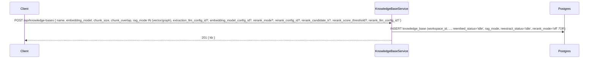
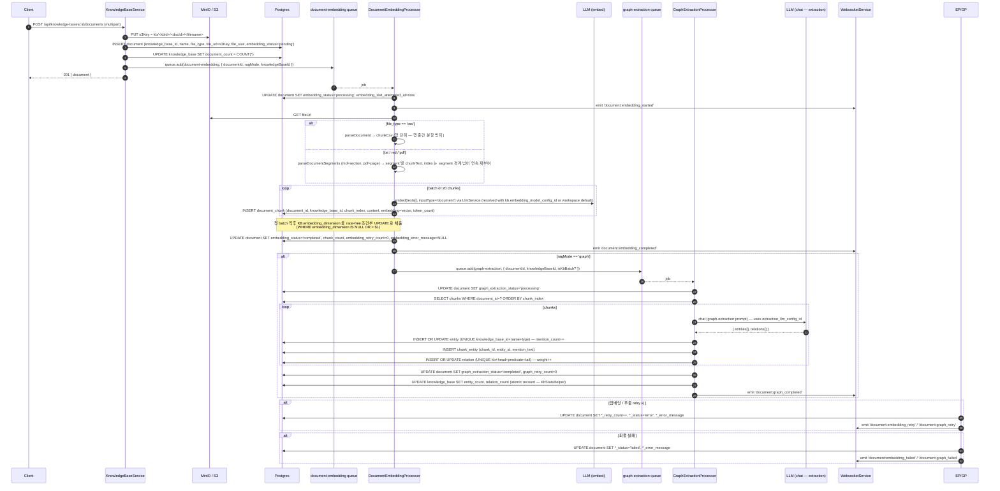
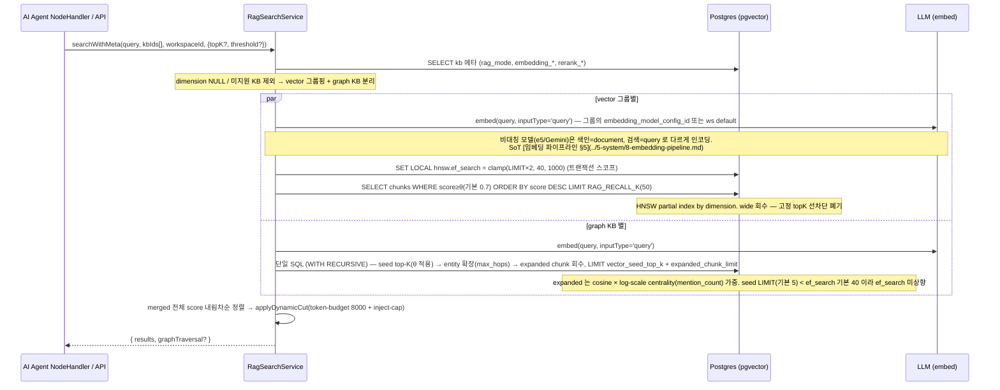
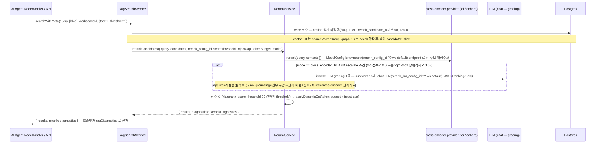
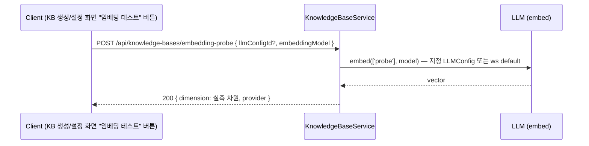
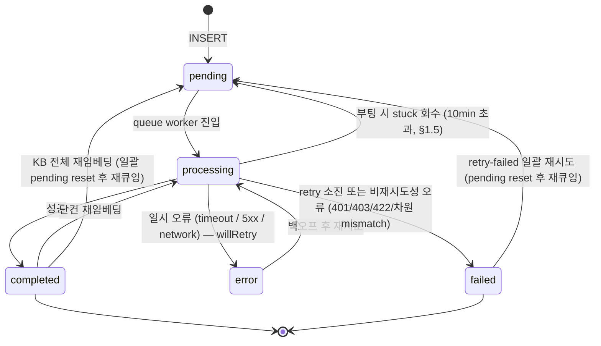

# Data Flow: Knowledge Base & RAG

> 관련 spec: [Spec 임베딩 파이프라인](../5-system/8-embedding-pipeline.md) · [Spec RAG 검색](../5-system/9-rag-search.md) · [Spec Graph RAG](../5-system/10-graph-rag.md) · [데이터 모델 §2.11~§2.12.4 · §2.16](../1-data-model.md) · [data-flow 개요](./0-overview.md)

---

## Overview

### System role

AI Agent 가 참조하는 문서 지식을 수집·청크·임베딩·검색하는 파이프라인. 두 가지 모드 (`vector` /
`graph`) 를 지원하며 KB 생성 시점에 모드가 결정된다 (이후 불변). Graph 모드는 임베딩 완료 후
chained dispatch 로 entity/relation 추출까지 이어진다.

검색은 **3단 구성** — ① wide 회수 (vector cosine / graph seed+확장) → ② 선택적 **리랭킹**
(`rerank_mode ≠ off`, 단일 KB 한정) → ③ 동적 컷 (token-budget + inject-cap). 멀티-KB 호출이
기본 시그니처이며, `embedding_dimension` 이 NULL 인 KB 는 검색에서 통째로 제외된다
(`not_searchable` 신호 — [RAG 검색 §2.2](../5-system/9-rag-search.md)).

코드 진입점:

- `codebase/backend/src/modules/knowledge-base/knowledge-base.service.ts` — KB / Document CRUD + S3 업/다운로드 + 임베딩 probe
- `codebase/backend/src/modules/knowledge-base/embedding/embedding.service.ts` — 문서 → 청크 → 임베딩
- `codebase/backend/src/modules/knowledge-base/graph/graph-extraction.service.ts` — chunk → entity/relation 추출
- `codebase/backend/src/modules/knowledge-base/graph/graph-query.service.ts` — 그래프 확장
- `codebase/backend/src/modules/knowledge-base/search/rag-search.service.ts` — vector / graph RAG 검색 + 리랭크 분기
- `codebase/backend/src/modules/knowledge-base/search/rerank.service.ts` — cross-encoder 재점수화 + listwise LLM grading
- `codebase/backend/src/modules/knowledge-base/search/dynamic-cut.util.ts` — 동적 컷 상수/함수 (`RAG_RECALL_K`, `applyDynamicCut`, `hnswEfSearchFor`)
- `codebase/backend/src/modules/rerank-config/` — 리랭커 provider 설정 (`rerank_config`) CRUD
- `codebase/backend/src/modules/knowledge-base/queues/*.ts` — BullMQ 큐 (document-embedding, graph-extraction) + 부팅 시 stuck 회수

---

## 1. Source → Sink

### 1.1 KB 생성

- rerank 필드 5개는 V082 에서 추가됐고 기본 `rerank_mode='off'` — 기존 KB / 미지정 생성은 현행
  동작이 그대로 보존된다. `PATCH /:id` 로도 갱신 가능하며 **검색 시점에 적용**되므로 재임베딩이
  필요 없다 (`knowledge-base.service.ts` `create`/`update`).

### 1.2 문서 업로드 → 임베딩 → (graph 모드면) 그래프 추출

### 1.3 RAG 검색 — rerank off (vector / graph 공통 경로)

`searchWithMeta(query, knowledgeBaseIds[], workspaceId, { topK?, threshold? })` — **멀티-KB 가
기본 시그니처**다. KB 메타를 일괄 조회한 뒤:

- `embedding_dimension` 이 NULL 이거나 지원 차원(partial HNSW index) 밖인 KB 는 **검색에서
  제외** (`groupVectorKbs` 의 skip / `isGraphKbSearchable` false). NULL 은 "모델 변경 후
  미재임베딩 / KB 전체 재임베딩 진행 중" 상태로, 호출부(KB tool)는 이를 `not_searchable`
  신호로 LLM 에 노출한다 — SoT [RAG 검색 §2.2/§6](../5-system/9-rag-search.md).
- vector KB 는 `(embedding_model, embedding_dimension, embedding_model_config_id)` 그룹 단위로
  묶어 그룹별 1회 query 임베딩 + 병렬 검색한다. 같은 모델명이라도 ModelConfig endpoint 가 다르면
  임베딩이 호환되지 않을 수 있어 그룹을 분리한다.
- graph KB 는 `max_hops`/`vector_seed_top_k` 가 KB 마다 달라 KB 단위로 병렬 처리한다.

- `SET LOCAL hnsw.ef_search` 상향(`hnswEfSearchFor`): pgvector HNSW 기본 `ef_search=40` 이
  LIMIT(50~200) 미만이면 recall@LIMIT 가 저하되므로, 회수 LIMIT×2 를 [40, 1000] 으로 clamp 해
  트랜잭션 스코프로 올린다 — 커넥션 풀 오염 없음 ([RAG 검색 §3.4](../5-system/9-rag-search.md)).
- 동적 컷(`applyDynamicCut`)은 vector·graph **merge 결과 전체**에 공통 적용된다 — θ 게이트는
  SQL 에서 이미 적용된 상태이므로 여기서는 token-budget(8000) 과
  inject-cap(명시 `topK` 또는 `RAG_MAX_INJECT_COUNT=12`) 만 본다.
- graph KB 가 하나라도 참여하면 `graphTraversal` 메타(seed/확장/깊이 집계)를 함께 반환한다.

### 1.4 RAG 검색 — rerank on (단일 KB + cross_encoder / cross_encoder_llm)

단일 KB 호출이면서 `rerank_mode ∈ (cross_encoder, cross_encoder_llm)` 일 때만 진입하는 검색
후처리 경로 (SoT [RAG 검색 §3.3](../5-system/9-rag-search.md)). agentic 경로(KB tool)는 항상
단일 KB 로 호출하므로 이 분기가 적용된다. 멀티-KB 리랭크는 후속
(`plan/in-progress/rag-rerank-followup.md`).

- **wide 회수에 cosine 임계를 적용하지 않는다** (θ=0) — 작은 후보군으로 미리 굶기면 리랭크가
  무의미하기 때문. 관련도 컷은 리랭크 점수에 대해 `rerank_score_threshold ?? 런타임 threshold`
  로 적용한다 (KB 설정 우선, NULL 이면 노드 `ragThreshold`/LLM 인자를 rerank 점수 임계로 재해석).
- `cross_encoder_llm` 은 `cross_encoder` 의 superset — 항상 cross-encoder 재점수화를 먼저
  수행하고, 상위 점수가 평탄/모호할 때만 **conditional escalate** 로 listwise LLM grading
  (survivor 15, 후보당 본문 500자) 을 1콜 추가한다. escalate 미발생은 정상이다.
- **어떤 실패에도 throw 하지 않는다** — 설정 해석 실패(`RERANK_CONFIG_INVALID`) / endpoint
  실패(`RERANK_ENDPOINT_FAILED`) / 유효 결과 없음(`RERANK_NO_VALID_RESULTS`) 시 원본 cosine
  점수 순으로 **안전 강등**한 뒤 동일한 동적 컷을 적용하고, `RerankDiagnostics.error` 에 코드를
  남긴다. grading 만 실패하면 cross-encoder 결과를 유지한다 (`RERANK_LLM_GRADING_FAILED`).
- `RerankDiagnostics` (mode / candidateCount / returnedCount / llmGradingApplied /
  gradingNoGrounding / cutoffApplied / error) 는 `searchWithMeta` 반환의 `rerank` 필드로
  호출부에 전파된다 — off 경로에서는 undefined ([RAG 검색 §4.2](../5-system/9-rag-search.md)).

### 1.5 재임베딩 / 재추출 / 일괄 재시도 / Stuck 회수

| 액션 | API / 트리거 | 동작 |
| --- | --- | --- |
| 문서 단건 재임베딩 | `POST /api/knowledge-bases/:id/documents/:docId/re-embed` | `document-embedding` queue 에 `reEmbed=true` 로 enqueue. 기존 chunks DELETE 후 처음부터. |
| KB 전체 재임베딩 | `POST /api/knowledge-bases/:id/re-embed` | `reembed_status` atomic CAS `idle → in_progress` — **같은 UPDATE 에서 `embedding_dimension=NULL` 초기화** (새 차원으로 다시 채워질 때까지 해당 KB 는 검색 제외, §1.3). 실패 시 409. 전 문서 `embedding_status='pending'` reset 후 `addBulk` (`isKbBatch=true`). 마지막 child 의 finalize 는 `reembed_status='idle'` reset **만** 수행. 빈 KB 는 child 가 없어 즉시 idle 복귀. |
| 문서 단건 재추출 | `POST /api/knowledge-bases/:id/documents/:docId/re-extract` | `graph-extraction` queue 에 enqueue. graph 모드 KB 만 허용. |
| KB 전체 재추출 | `POST /api/knowledge-bases/:id/re-extract` | `reextract_status` CAS. 모든 문서 `addBulk`. 모든 entity / relation / chunk_entity DELETE 후 다시 채움. |
| 실패 문서 일괄 재시도 | `POST /api/knowledge-bases/:id/retry-failed` (scope: embedding/graph/all) | `*_status='failed'` 문서를 `pending` reset (retry_count·error_message 초기화) 후 100건 단위 `addBulk` 재큐잉. `isKbBatch=false` — KB 잠금 불관여. `addBulk` 실패 시 해당 chunk 의 문서를 `failed` 로 롤백 (UPDATE-큐 비원자성 보완). |
| Stuck 회수 | `StuckDocumentRecoveryService` — **백엔드 부팅 시 1회** (`OnApplicationBootstrap`) | `embedding_status='processing'` 이고 `embedding_last_attempted_at` 이 10분 초과 경과한 문서를 단일 `UPDATE...RETURNING` 으로 `pending` 전환 + `addBulk` 재큐잉 (graph 도 동일 패턴). `last_attempted_at` NULL 레거시는 제외. 다중 인스턴스 동시 부팅에도 row-lock + RETURNING 으로 이중 큐잉 차단. |

### 1.6 임베딩 probe

KB 저장 **전에** 모델/LLMConfig 조합의 실제 vector 차원을 라이브 측정해 반환한다 —
자기호스팅/Azure 처럼 모델명이 같아도 차원이 다른 endpoint 를 저장 전에 시각적으로 알리기 위함.
버튼 클릭으로만 트리거 (자동 호출 아님, throttle 30/min). 실패는
400 `EMBEDDING_PROBE_FAILED` + sanitize 된 메시지 (내부 URL/API key 누출 방지).

---

## 2. Schema 매핑

### 2.1 Postgres

| Sink (table) | 흐름 | 핵심 컬럼 | 인덱스 / 제약 |
| --- | --- | --- | --- |
| `knowledge_base` | 생성 | `workspace_id, name, embedding_model, embedding_dimension?, chunk_size, chunk_overlap, document_count, reembed_status, rag_mode, extraction_llm_config_id?, embedding_model_config_id? (V091), max_hops, vector_seed_top_k, expanded_chunk_limit, entity_count, relation_count, reextract_status` + rerank 5컬럼 (V082): `rerank_mode IN (off/cross_encoder/cross_encoder_llm), rerank_config_id? (FK model_config kind=rerank SET NULL), rerank_candidate_k (1~200 CHECK), rerank_score_threshold?, rerank_llm_config_id? (FK model_config kind=chat SET NULL)` | FK CASCADE on `workspace_id` |
| `knowledge_base` | 임베딩 완료 시 | UPDATE `embedding_dimension` (첫 batch 직후 race-free 조건부 UPDATE), `document_count` | NULL reset 경로 **2개**: ① KB 전체 재임베딩 CAS 진입 시 (V021) ② `PATCH /:id` 로 `embedding_model` 실제 변경 시. NULL 인 동안 해당 KB 는 검색 제외 (§1.3) |
| `model_config` (kind=rerank) | 리랭커 설정 (V081 → V090 흡수) | `workspace_id, kind='rerank', provider, name, api_key? (셀프호스팅 tei 는 불요), base_url?, default_model, is_default` | `(workspace_id, kind)` 당 `is_default=TRUE` 최대 1개 (partial unique index). CRUD 는 `/api/model-configs?kind=rerank` (PR4 까지 `/api/rerank-configs` alias) |
| `document` | 업로드 | INSERT `knowledge_base_id, name, file_type IN (txt/md/pdf/csv), file_url, file_size, embedding_status='pending', tags='{}', metadata={}` | FK CASCADE on `knowledge_base_id` |
| `document` | 임베딩 라이프사이클 | UPDATE `embedding_status, embedding_retry_count, embedding_last_attempted_at, embedding_error_message, chunk_count` | V037 `embedding_status` CHECK 갱신, V039 legacy CHECK drop |
| `document` | 그래프 라이프사이클 | UPDATE `graph_extraction_status, graph_retry_count, graph_last_attempted_at, graph_error_message` | V025/V026 |
| `document` | retry 재시도 인덱스 | — | V038 partial index on `embedding_status IN (error, failed)` 등 stuck 회수용 |
| `document_chunk` | 임베딩 적재 | INSERT `document_id, knowledge_base_id, chunk_index, content, embedding (vector), token_count, metadata` | `(document_id, chunk_index) UNIQUE`. HNSW partial indexes per dimension (V022 768, V030 384/512/1024, V031 1536, V032 512, V033 1024) — `embedding_dimension` 별로 매칭된 index 가 검색에 활용. V023 halfvec 인덱스는 3072 차원 처리. |
| `entity` | graph 추출 | INSERT/UPDATE `knowledge_base_id, name, display_name, type IN (person/organization/concept/location/event/other), description?, mention_count, last_seen_chunk_id?` | `(knowledge_base_id, name, type) UNIQUE`, V025 `idx_entity_kb_type`, `idx_entity_kb_mention (mention_count DESC)` |
| `relation` | graph 추출 | INSERT/UPDATE `knowledge_base_id, head_entity_id, tail_entity_id, predicate, evidence_chunk_id?, weight` | `(kb, head, predicate, tail) UNIQUE` (V025), V027 `(kb, head)` / `(kb, tail)` 인덱스 |
| `chunk_entity` | graph 추출 | INSERT `chunk_id, entity_id, mention_text?` | PK `(chunk_id, entity_id)`, V025 `(entity_id)` 역방향 인덱스 |
| `chunk_entity` / `entity` / `relation` | KB 재추출 | DELETE all (CASCADE via knowledge_base_id) before re-populate | — |

### 2.2 Redis (BullMQ)

| 큐 | producer | consumer | payload |
| --- | --- | --- | --- |
| `document-embedding` | KB 문서 업로드 / 재임베딩 API / retry-failed / 부팅 시 stuck recovery | `DocumentEmbeddingProcessor` (concurrency 3) | `{ documentId, reEmbed?, isKbBatch?, knowledgeBaseId?, ragMode? }` (`document-embedding.queue.ts`) |
| `graph-extraction` | `DocumentEmbeddingProcessor.onCompleted` (chained), 재추출 API, retry-failed, stuck recovery | `GraphExtractionProcessor` (concurrency 2 — LLM rate limit) | `{ documentId, knowledgeBaseId, isKbBatch? }` (`graph-extraction.queue.ts`) |

### 2.3 S3 / MinIO

| Bucket / prefix | 흐름 | 비고 |
| --- | --- | --- |
| `<bucket>/kb/<kbId>/<docId>/<filename>` | 업로드 시 PUT, 임베딩 시 GET, 문서 삭제 시 DELETE | 코드 기준: `knowledge-base.service.ts` `uploadDocument` 의 `s3Key`. `spec/0-overview.md §2.7` 의 `{workspaceId}/knowledge-base/...` 와 다름 (data-flow/0-overview Rationale 참고) |

### 2.4 외부

| Sink | 흐름 | 비고 |
| --- | --- | --- |
| LLM provider (embed) | 임베딩 / 검색 query embed / 임베딩 probe | `LlmService.embed`. 사용량 → [`llm-usage.md`](./7-llm-usage.md) |
| LLM provider (chat) | graph 추출 prompt | `LlmService.chat` with `extraction_llm_config_id` 또는 ws default |
| cross-encoder rerank provider | rerank 후보 재점수화 (§1.4) | `RerankClientFactory` — provider `tei`(셀프호스팅, api_key 불요) / `cohere`. endpoint 는 `model_config` (kind=rerank) 행이 정의 |
| LLM provider (chat — grading) | `cross_encoder_llm` conditional escalate 시 listwise grading 1콜 | `rerank_llm_config_id` 또는 ws default. 사용량 → [`llm-usage.md`](./7-llm-usage.md) |

### 2.5 WebSocket

채널은 모두 `kb:${documentId}` (KB ID 가 아니라 **문서 ID** 가 채널 키). 권위 정의는 backend
`WebsocketService` 의 `KbEventType` union — **총 11개** (embedding 6 + graph 5.
`document:graph_error` 는 emit 경로가 없어 union 에서 제거됨 — #443).

| Event | 발행 |
| --- | --- |
| `document:embedding_started` / `_progress` / `_completed` / `_retry` / `_failed` | `EmbeddingService.emitEvent` |
| `document:embedding_error` | union 에 정의돼 있으나 현재 backend emit 경로 없음 — 일시 오류는 `embedding_status='error'` 전환과 함께 `_retry` 이벤트로 통지된다 |
| `document:graph_started` / `_progress` / `_completed` / `_retry` / `_failed` | `GraphExtractionService.emitEvent` |

> KB-level batch 이벤트(`kb:reembed_started/finished`, `kb:reextract_started/finished`,
> `kb:graph_stats_updated`) 는 spec 폐기 + **dead-path 코드 제거 완료** — backend 에 emit 경로가
> 없고 `kb-stats.helper.ts` 의 과거 경위 주석만 남아 있다. frontend 는
> `document:graph_completed` 수신 시 React Query invalidate 로 통계를 갱신한다
> (결정 근거: `spec/5-system/6-websocket-protocol.md ## Rationale`).

---

## 3. 상태 전이

### 3.1 `document.embedding_status` (graph_extraction_status 도 동일 의미)

- 재시도 정책: `attempt=0` (1차) → 백오프 1s/4s/16s + ±30% jitter, 최대 3회
  (`embedding.service.ts` `EMBED_MAX_RETRIES`/`EMBED_BASE_DELAY_MS`)
- `embedding_retry_count` 는 모든 attempt 실패마다 누적. 성공 시 0 reset.
- 2차+ attempt 는 `reEmbed=true` 강제로 부분 INSERT chunk 정리 (idempotency).

### 3.2 `knowledge_base.reembed_status` / `reextract_status`

| 상태 | 진입 / 종료 |
| --- | --- |
| `idle` | default. CAS `idle → in_progress` 로 진입 |
| `in_progress` | KB 전체 재임베딩/재추출 진행 중. 동일 동작 재실행 시 409. 마지막 child job 의 finalize 가 `idle` 로 reset (남은 pending/processing 0건일 때만 — atomic 단일 UPDATE). |

> 재임베딩 CAS 진입 UPDATE 는 `embedding_dimension=NULL` 초기화를 **동시에** 수행한다
> (재임베딩 한정 — 재추출 CAS 는 dimension 을 건드리지 않음). finalize 는 status reset 만 한다.

---

## 4. 외부 의존

| 의존 | 방향 | 참고 |
| --- | --- | --- |
| LLM 도메인 | 외부 | embed / chat 호출, `llm_config_id` 해석 |
| cross-encoder rerank provider | 외부 | `model_config` (kind=rerank) 행이 정의하는 endpoint (tei / cohere) — §2.4 |
| LLM Usage | cross-ref | 모든 LLM 호출은 `llm_usage_log` 적재 — [`llm-usage.md`](./7-llm-usage.md) |
| File Storage | cross-ref | KB 가 S3 의 유일한 production 사용처 — [`file-storage.md`](./4-file-storage.md) |
| Execution 도메인 | cross-ref | AI Agent 노드가 KB tool 로 RAG 검색 호출 |
| RAG 평가 하네스 | cross-ref | 오프라인 `eval/` CLI — 합성 골든셋 + 검색 지표로 검색 품질 회귀 측정. SoT [`conventions/rag-evaluation.md`](../conventions/rag-evaluation.md) |

---

## Rationale

### `rag_mode` 가 생성 시 불변

vector / graph 는 같은 `document_chunk` table 을 공유하지만 graph 모드는 추가로 `entity / relation /
chunk_entity` 를 채운다. 모드 전환을 사후에 허용하면 (예: vector → graph) 모든 청크에 대해 추출을 다시
돌려야 하고, 그 동안 검색 일관성이 깨진다. P0~P2 에서는 생성 시 결정 / 불변 으로 단순화했다
(`spec/5-system/10-graph-rag.md`).

### chained dispatch (embedding → graph) 의 이유

graph 모드 KB 에서 새 문서가 임베딩되자마자 entity/relation 추출까지 자동으로 이어지는 게 자연스러운
UX 다. `DocumentEmbeddingProcessor.onCompleted` 에서 `graph-extraction` 큐에 자동 enqueue 하면
사용자가 추가 API 를 호출하지 않아도 된다 (`graph-extraction.queue.ts` 주석). 큐를 분리한 이유는
graph 추출이 LLM chat (느림·rate limit 빡빡) 인 반면 embedding 은 embed API (빠름·throughput 크다)
라 concurrency 정책이 달라야 하기 때문이다 (embedding=3, graph=2).

### HNSW partial index 분리

`embedding_dimension` 이 KB 마다 다르다 (provider/모델별 384, 512, 768, 1024, 1536, 3072 …). 단일
인덱스에 다 차원 vector 가 섞이면 검색이 비효율적이므로 V022/V030~V033 으로 차원별 partial HNSW
인덱스를 분리했다. 3072 차원은 pgvector 제약으로 raw vector 가 HNSW 에 못 들어가 V023 의 halfvec
인덱스를 사용한다.

### S3 key 패턴의 코드/spec 불일치

`spec/0-overview.md §2.7` 은 `{workspaceId}/knowledge-base/{kbId}/{documentId}_{filename}` 을
제안하지만 현재 코드는 `kb/{kbId}/{docId}/{filename}` 으로 업로드한다. data-flow 는 코드 기준으로
기재한다 ([`file-storage.md`](./4-file-storage.md) Rationale 참고).

### 리랭킹을 검색-시점 후처리로 둔 이유

`rerank_mode` 와 관련 설정은 모두 **검색 시점**에만 읽힌다 — 청크/임베딩 적재물은 그대로이므로
모드를 켜고 끄거나 설정을 바꿔도 재임베딩이 필요 없다. 기본값 `off` 라 기존 KB 와 미지정 생성은
현행 동작이 보존된다 (V082 하위호환). rerank 점수 임계를 신규 필드 없이
`rerank_score_threshold ?? 런타임 threshold` 로 fallback 하는 것도 같은 원칙(신규 config 필드
증식 회피)이다 ([RAG 검색 §3.3 Rationale](../5-system/9-rag-search.md)).

### 리랭커를 `model_config` 의 `kind=rerank` 로 흡수한 이유

cross-encoder 리랭커는 chat/embedding 과 API shape 가 다르지만(전용 `/rerank` 호출), provider
자격증명·endpoint·마스킹·SSRF 가드라는 설정 골격은 동일하다. 따라서 이전의 별도 `rerank_config`
sibling 테이블(V081) 은 `model_config` 의 `kind=rerank` row 로 흡수했고(V090), API shape 차이는
실행 레이어 `RerankClientFactory` 가 `kind` 로 분기해 흡수한다 — 통합 근거 SoT 는
[데이터 모델 §2.16 Rationale](../1-data-model.md#216-modelconfig) · [설정 §Rationale R-3](../2-navigation/6-config.md). rerank row 는 chat/embedding row 와 비교해 ① `api_key` NULLABLE (tei/local
셀프호스팅은 키 불요) ② `default_params` 없음 (호출 파라미터 프리셋이 없다) 두 가지가 다르다.
`(workspace_id, kind)` 당 default 1개는 partial unique index 로 강제한다.

### `ef_search` 를 SET LOCAL 로 상향한 이유

wide 회수(D1)가 LIMIT 을 50(`RAG_RECALL_K`)~200(rerank `candidate_k` 상한)으로 넓혔는데 pgvector
HNSW 기본 `ef_search=40` 은 LIMIT 미만이라 recall@LIMIT 가 저하된다. `ef_search ≥ LIMIT` 정설에
2× 헤드룸을 주되 [40, 1000] 으로 clamp 하고, `SET LOCAL` (트랜잭션 스코프) 로 적용해 커넥션 풀
오염이 없다. graph seed 는 LIMIT(기본 5)이 기본값보다 작아 상향하지 않는다 (#503).

### 폐기·정정된 과거 서술 (이력)

- ~~Stuck 회수가 cron 으로 `processing/pending` 문서를 `error` 마킹 후 재큐잉~~ → 실제 구현은
  **부팅 시 1회**(`OnApplicationBootstrap`) `processing`(10분 초과) → `pending` 재큐잉이다 (§1.5).
- ~~`embedding_dimension=NULL` reset 이 finalize 에서 수행~~ → CAS **진입** UPDATE 에서 수행하고
  finalize 는 status reset 만 한다 (§1.5/§3.2).
- ~~`KbEventType` 12개 + `document:graph_error`~~ → `graph_error` 는 #443 에서 제거, union 은
  11개다 (§2.5).
- ~~KB-level batch 이벤트는 dead path — "emit 경로 수정 또는 코드 제거 필요"~~ → 코드 제거가
  완료되어 조치 필요 없음 (§2.5 note).
