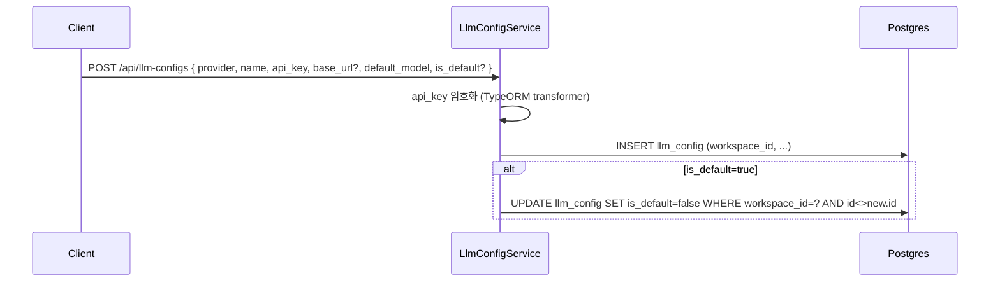
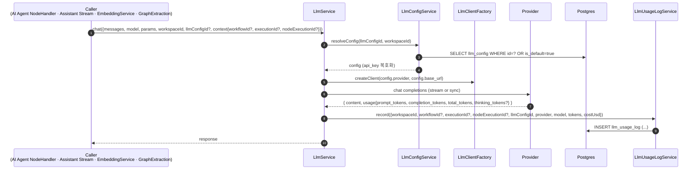

# Data Flow: LLM 호출 및 사용량 (LLM Usage)

> 관련 spec: [Spec LLM Client](../5-system/7-llm-client.md) · [데이터 모델 §2.16](../1-data-model.md) · [data-flow 개요](./0-overview.md)

---

## Overview

### System role

워크스페이스 단위 LLM Config (provider + API key + base_url + default_model) 를 관리하고, 모든
LLM 호출을 단일 facade (`LlmService`) 로 통합한다. 호출마다 사용 토큰·비용을 `llm_usage_log` 에
적재해 통계 / 알림 / 사용량 트래킹의 진실 소스로 삼는다.

코드 진입점:

- `codebase/backend/src/modules/llm-config/llm-config.service.ts` — LLMConfig CRUD
- `codebase/backend/src/modules/llm/llm.service.ts` — `chat`, `embed`, `resolveConfig`
- `codebase/backend/src/modules/llm/llm-client.factory.ts` — provider 별 client 생성 (OpenAI · Anthropic · Google · Azure · Ollama · vLLM)
- `codebase/backend/src/modules/llm/llm-usage-log.service.ts` — usage 적재
- `codebase/backend/src/modules/llm/llm-preview.service.ts` — UI 의 모델 시험 호출

---

## 1. Source → Sink

### 1.1 LLMConfig 등록

### 1.2 LLM 호출 (chat / embed) — 전형적 흐름

### 1.3 Caller 카탈로그

| Caller | 호출 종류 | usage_log 적재 필드 |
| --- | --- | --- |
| `AI Agent` 노드 | chat (tool calling 포함) | `workflow_id, execution_id, node_execution_id` 모두 채움 |
| `Text Classifier` / `Information Extractor` 노드 | chat | 동일 |
| `WorkflowAssistantStreamService` | chat (streaming) | `workflow_id` 채우고 execution/node 는 NULL. `usage` 는 message row 와 log 양쪽에 적재 |
| `EmbeddingService` (KB) | embed | `workflow_id, execution_id, node_execution_id` 가 KB 업로드 경로에서는 NULL. AI Agent 가 KB 도구로 호출 시는 채움 |
| `GraphExtractionService` | chat | KB 추출 경로에서 호출. node context 없음 |
| `LlmPreviewService` | chat (UI 모델 시험) | 모든 컨텍스트 NULL |

---

## 2. Schema 매핑

### 2.1 Postgres

| Sink (table) | 흐름 | read/write 컬럼 | 인덱스 / 제약 |
| --- | --- | --- | --- |
| `llm_config` | 생성·갱신 | INSERT/UPDATE `workspace_id, provider, name, api_key (encrypted), base_url?, default_model, default_params, is_default` | V001 + `llm_config_workspace_default_unique` (`workspace_id WHERE is_default=true`) UNIQUE partial — 워크스페이스 당 default 1개 |
| `llm_usage_log` | 호출 후 | INSERT `workspace_id, workflow_id?, execution_id?, node_execution_id?, llm_config_id?, provider, model, prompt_tokens, completion_tokens, total_tokens, thinking_tokens? (V018), cost_usd?` | V014/V018. `(workspace_id, created_at)`, `(provider, model, created_at)` 통계용 |

### 2.2 외부

| Sink | 흐름 |
| --- | --- |
| OpenAI / Anthropic / Google / Azure OpenAI / Ollama / vLLM | chat / embed |

---

## 3. 상태 전이

상태 머신은 없다. `llm_usage_log` 는 append-only 다.

### 3.1 비용 계산

- `LlmService` 가 provider 응답의 token 수를 받아 `pricing.ts` 의 (provider, model) → (input_per_M, output_per_M) 단가 표로 `cost_usd` 를 계산
- 단가표에 없는 모델은 `cost_usd = NULL` (집계 시 unknown 으로 분류)
- `thinking_tokens` (예: o1 류) 는 별도 컬럼이며 단가는 output 단가에 합산되어 `cost_usd` 에 포함 (V018)

---

## 4. 외부 의존

| 의존 | 방향 | 참고 |
| --- | --- | --- |
| Knowledge Base | cross-ref | embed (모든 KB 청크) + chat (graph 추출). 사용량 동일하게 적재 |
| Execution | cross-ref | AI 노드 호출 진입. 노드 컨텍스트 채움 |
| Workflow Assistant | cross-ref | session 메시지 turn 종료 시점 usage 적재 |
| Dashboard / Statistics | downstream | `llm_usage_log` 집계 |
| Alerts | downstream | usage threshold 알람 (`alert_rule`) |

---

## Rationale

### 모든 호출을 `LlmService` 로 통합

provider 마다 SDK / API spec 이 다르지만 호출 측 (노드·KB·Assistant) 은 동일한 표면 (`chat`, `embed`)
만 알면 된다. provider 분기는 `LlmClientFactory` 단 하나에 집중되어 새 provider 추가 시 caller 변경
없이 확장 가능하다 (`spec/5-system/7-llm-client.md`).

### `is_default` partial UNIQUE

워크스페이스마다 default LLMConfig 가 정확히 1개여야 한다. `WHERE is_default=true` 조건의 partial
unique index (entity `llm_config_workspace_default_unique`) 로 DB 단에서 강제. application 단에서는
새 default 설정 시 기존 default 를 동일 트랜잭션에서 unset 한다.

### `llm_usage_log` 의 nullable context 컬럼들

`workflow_id / execution_id / node_execution_id / llm_config_id` 가 모두 nullable 인 이유는 호출
경로마다 컨텍스트가 다르기 때문이다 (예: `LlmPreviewService` 는 모두 NULL). 통계에서 "워크플로우별 비용"
같은 query 는 `WHERE workflow_id = ?` 로 필터하면 자동으로 preview·KB 임베딩 같은 무관 호출이 제외된다.
