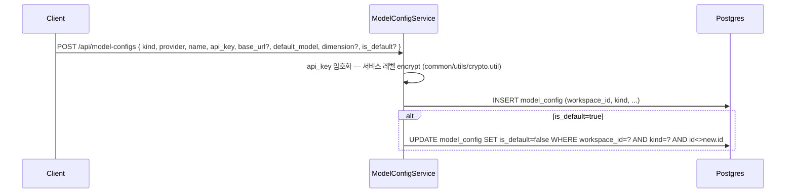
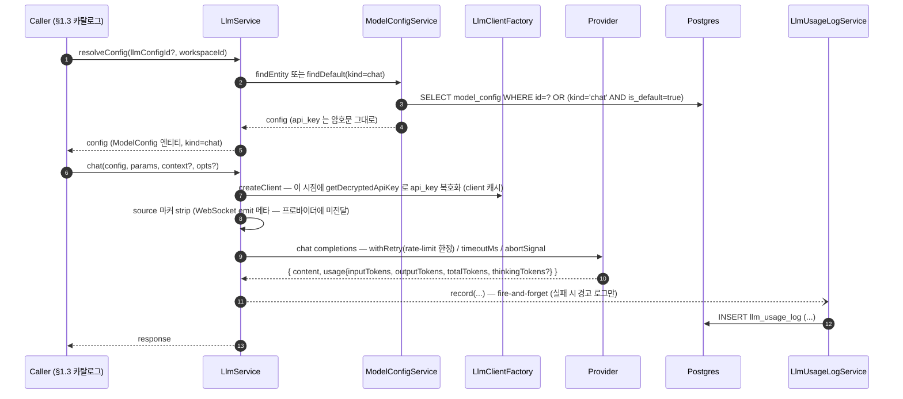

# Data Flow: LLM 호출 및 사용량 (LLM Usage)

> 관련 spec: [Spec LLM Client](../5-system/7-llm-client.md) · [Spec 임베딩 파이프라인](../5-system/8-embedding-pipeline.md) · [Spec Agent Memory](../5-system/17-agent-memory.md) · [데이터 모델 §2.16](../1-data-model.md) · [data-flow 개요](./0-overview.md)

---

## Overview

### System role

워크스페이스 단위 Model Config (kind=chat/embedding — provider + API key + base_url + default_model) 를 관리하고, 모든
LLM 호출을 단일 facade (`LlmService`) 로 통합한다. **chat 계열 호출 (`chat` / `chatStream`)** 의
사용 토큰·비용을 `llm_usage_log` 에 적재해 통계 / 알림 / 사용량 트래킹의 진실 소스로 삼는다.
`embed` 는 동일 facade 를 거치지만 **usage 를 적재하지 않는다** (§1.3, §Rationale). (rerank kind 는 전용 `/rerank` 경로 — 본 흐름 밖, [데이터 모델 §2.16](../1-data-model.md#216-modelconfig).)

코드 진입점:

- `codebase/backend/src/modules/model-config/model-config.service.ts` — ModelConfig CRUD (구 llm-config, `(V088)` 통합) · default 스왑 · api_key encrypt/decrypt
- `codebase/backend/src/modules/llm/llm.service.ts` — `chat` · `chatStream` · `embed` · `resolveConfig` · `listModels` · `testConnection` · `hasDefaultLlmConfig`
- `codebase/backend/src/modules/llm/llm-client.factory.ts` — provider 별 client 생성. switch 분기 5종: `openai` · `anthropic` · `google` · `azure` · `local`. `local` 은 OpenAI 호환 엔드포인트(Ollama · vLLM 등)를 base_url 로 받는 `LocalClient` (`OpenAIClient` 확장) 이며 독립 provider enum 이 아니다 (`clients/local.client.ts`)
- `codebase/backend/src/modules/llm/llm-usage-log.service.ts` — usage 적재 (chat 계열 전용)
- `codebase/backend/src/modules/llm/llm-preview.service.ts` — **미저장 폼 자격증명으로 모델 목록만 조회하는 preview** (`previewModels` → `client.listModels`). chat 을 호출하지 않으며 usage_log 에 어떤 행도 남기지 않는다. 핵심 로직은 SSRF 가드 (`isPrivateHost` / `resolvesToPrivate` — [Spec LLM Client §5.5](../5-system/7-llm-client.md))

인프라 메모:

- `LLM_STUB_MODE=true` 시 `createClient` 가 결정적 `StubLlmClient` 를 반환한다 (dockerized e2e 전용, 프로덕션은 main.ts 부팅 가드로 차단 — [Spec LLM Client §7.1](../5-system/7-llm-client.md)).
- **리랭크 호출 계통은 별도 경로다**: `model_config` (kind=rerank, 구 rerank_config V081→V090 흡수) + `RerankClientFactory` (`tei` / `cohere`, `modules/llm/rerank/**`) 는 `LlmService` 를 거치지 않는 전용 `/rerank` 외부 호출이며 usage_log 미적재. 단, `cross_encoder_llm` 모드의 listwise LLM grading 은 `LlmService.chat` 을 쓰므로 usage 가 적재된다 (§1.3). 상세: [Spec LLM Client §4.1](../5-system/7-llm-client.md), [데이터 모델 §2.16](../1-data-model.md#216-modelconfig).

---

## 1. Source → Sink

### 1.1 ModelConfig 등록·관리

- 암호화는 TypeORM transformer 가 아니라 **서비스 레벨** 이다: 생성/수정 시 `encrypt(dto.apiKey, encryptionKey)` (`llm-config.service.ts` `create`/`update`), 복호화는 `LlmService.createClient` 가 client 생성 직전 `getDecryptedApiKey` 로 수행한다. 조회 응답의 api_key 는 `****` + 마지막 4자로 마스킹.
- default 지정 경로는 `create`/`update` 의 `saveWithDefaultSwap` 과 `PATCH :id/set-default` 모두 단일 트랜잭션으로 기존 default 를 unset 한다.
- 부속 엔드포인트 (`llm-config.controller.ts`; PR4 까지 `/api/llm-configs` alias 유지):
  - `POST /api/model-configs/preview-models` — `LlmPreviewService.previewModels` (미저장 자격증명, SSRF 가드, 30s 타임아웃, 캐시 없음)
  - `POST /api/model-configs/:id/test` — `LlmService.testConnection`
  - `GET /api/model-configs/:id/models` — `LlmService.listModels`. config 별 5분 캐시 (key `${workspaceId}|${configId}`), 30s 타임아웃, `?type=chat|embedding` 필터
- config 수정/삭제 시 controller 가 `LlmService.clearClientCache(id)` 를 호출해 **client 캐시 + listModels 캐시** 를 함께 무효화한다.

### 1.2 chat / chatStream 흐름 — usage 적재는 chat 계열만

호출 신뢰성 계약 (`LlmCallOptions`, `llm.service.ts`):

- `timeoutMs` — 0/미지정 시 타임아웃 없음. `withTimeout` race
- `signal` — node-cancellation 컨벤션 ([`spec/conventions/node-cancellation.md`](../conventions/node-cancellation.md)). abort 시 SDK 즉시 throw, retry 대상 아님
- `disableInnerRetry` — 호출자가 자체 retry layer (예: KB 의 `retryWithBackoff`) 를 가질 때 내부 재시도를 꺼 호출 증폭 방지
- 내부 `withRetry` 는 **rate-limit (HTTP 429 / "rate limit") 한정** 최대 3회 재시도. RFC 7231 `Retry-After` 헤더 (delta-seconds / HTTP-date) 가 있으면 우선하되 상한 60s, 없으면 지수 백오프

usage 적재 정책:

- `record` 는 **fire-and-forget** — 기록 실패는 호출 결과에 영향 없이 경고 로그만 남긴다 (`llm-usage-log.service.ts`)
- `chatStream` 은 `done` 이벤트에 usage 가 실려 오고 `totalTokens > 0` 일 때만 기록한다 — abort/error 로 불완전한 응답이 0건으로 기록되는 것을 피한다
- `workspaceId` 는 항상 `config.workspaceId` 로 자동 채워진다. `workflowId / executionId / nodeExecutionId` 는 호출부가 `LlmCallContext` 로 명시할 때만 채워진다 (§1.3)

`embed` 는 동일 facade 를 거치지만 (20개 단위 batch, batch 별 timeout/retry, `inputType` `'document'|'query'` 비대칭 힌트 — [임베딩 파이프라인 §5](../5-system/8-embedding-pipeline.md)) **usage 를 기록하지 않는다**. provider embed API 가 토큰 usage 를 반환하지 않아 (`client.embed` 반환형은 `number[][]` 뿐) 임베딩 비용은 현재 트래킹 범위 밖이다.

### 1.3 Caller 카탈로그 (코드 기준)

**chat 계열 (usage_log 적재됨):**

| Caller | 호출 종류 | usage_log 컨텍스트 필드 |
| --- | --- | --- |
| `AI Agent` 노드 (`nodes/ai/ai-agent/ai-agent.handler.ts`, chat 호출 4곳) | chat (tool calling 포함) | **context 미전달 → `workflow_id / execution_id / node_execution_id` 전부 NULL** (현행 한계 — abortSignal 만 opts 로 전달) |
| `Text Classifier` (`text-classifier.handler.ts`) / `Information Extractor` (`information-extractor.handler.ts` `traceChat`) 노드 | chat | 동일 — context 미전달, 전부 NULL |
| AI Agent 자동 메모리 롤링 요약 압축 (`nodes/ai/shared/agent-memory-injection.ts`) | chat | context 미전달, 전부 NULL |
| `WorkflowAssistantStreamService` (`workflow-assistant-stream.service.ts`) | chatStream | `workflow_id` 만 채움 (`{ workflowId: session.workflowId }`). usage 는 assistant message row (`persistAssistantTurn` → `appendMessage.usage`) 와 usage_log **양쪽**에 적재 |
| `GraphExtractionService` (KB graph 추출, `knowledge-base/graph/graph-extraction.service.ts`) | chat | context 미전달, 전부 NULL. `timeoutMs` + `disableInnerRetry` (외부 `retryWithBackoff` 가 재시도 통제) |
| `RerankService` listwise LLM grading (`cross_encoder_llm` escalate 시, `knowledge-base/search/rerank.service.ts`) | chat | context 미전달, 전부 NULL |
| AgentMemory 추출 processor (BullMQ, `agent-memory/queues/agent-memory-extraction.processor.ts`) | chat | context 미전달, 전부 NULL |

> **attribution 갭**: 현재 `workflow_id` 를 채우는 caller 는 Workflow Assistant 뿐이다. AI 노드 3종이 `ExecutionContext` 의 ID 들을 `LlmCallContext` 로 전달하지 않으므로, `WHERE workflow_id = ?` 기반의 워크플로우별 비용 집계 (Statistics `workflowId` 필터, Alerts `llm_cost` 의 workflow 스코프) 에서 **노드 발 호출이 전부 누락**된다. 워크스페이스 단위 집계는 `workspace_id` 자동 채움으로 정상이다. (코드 수정 결정 전까지 현행 사실대로 기재 — §Rationale)

**embed 계열 (usage_log 미적재):**

| Caller | inputType | config 선택 |
| --- | --- | --- |
| `EmbeddingService` (KB 청크 적재, `knowledge-base/embedding/embedding.service.ts`) | `document` | `kb.embeddingLlmConfigId` (V029) 우선, NULL 이면 ws default 폴백 |
| KB 차원 probe (`knowledge-base.service.ts` `probeEmbedding`) | `document` | dto 지정 또는 ws default |
| RAG 검색 query 임베딩 (`knowledge-base/search/rag-search.service.ts`, 2곳) | `query` | 해당 KB(그룹) 가 청크 임베딩에 쓴 config — mismatch 방지 |
| AgentMemory 저장 / 회수 (`agent-memory/agent-memory.service.ts`) | 저장 `document` / recall `query` | 노드 `llmConfigId` 또는 ws default |

---

## 2. Schema 매핑

### 2.1 Postgres

| Sink (table) | 흐름 | read/write 컬럼 | 인덱스 / 제약 |
| --- | --- | --- | --- |
| `model_config` | 생성·갱신 | INSERT/UPDATE `workspace_id, kind, provider, name, api_key (encrypted), base_url?, default_model, default_params, dimension?, is_default` | V001(구 llm_config)→`(V088)` rename + kind/dimension. `model_config_workspace_kind_default_unique` (`(workspace_id, kind) WHERE is_default=true`) UNIQUE partial `(V089)` — kind 별 default 1개. (구 `llm_config` 시절 `@Index` 선언만 있고 SQL 마이그레이션이 없던 `llm_config_workspace_default_unique` 는 본 통합에서 V089 가 SQL 로 실제 생성하며 대체됨 — 이전의 "DB 단 강제 부재, application 트랜잭션만으로 보장" 상태를 해소.) |
| `llm_usage_log` | chat 계열 호출 후 | INSERT `workspace_id, workflow_id?, execution_id?, node_execution_id?, llm_config_id?, provider, model, prompt_tokens, completion_tokens, total_tokens, thinking_tokens? (V018), cost_usd?` | V014/V018. `(workspace_id, created_at DESC)`, `(provider, model, created_at DESC)`, `(workflow_id, created_at DESC) WHERE workflow_id IS NOT NULL` (partial) 통계용 |
| `knowledge_base.embedding_model_config_id` | KB 임베딩 config 선택 | V091. NULL → ws default 폴백 | FK `ON DELETE SET NULL` |

### 2.2 외부

| Sink | 흐름 |
| --- | --- |
| OpenAI / Anthropic / Google / Azure OpenAI / OpenAI 호환 local 엔드포인트 (`local` provider — Ollama · vLLM 등) | chat / chatStream / embed / listModels / testConnection (`LLMClientFactory`) |
| (인접 경로) Rerank provider — `tei` (셀프호스팅) / `cohere` | `RerankClientFactory` 전용 `/rerank` 호출. `LlmService`·usage_log 와 분리, usage 미적재 ([Spec LLM Client §3.6·§5.6](../5-system/7-llm-client.md)) |

---

## 3. 상태 전이

상태 머신은 없다. `llm_usage_log` 는 append-only 다.

### 3.1 비용 계산

- `LlmUsageLogService.record` 가 provider 응답의 token 수를 받아 `pricing.ts` 의 `calculateCostUsd(provider, model, promptTokens, completionTokens)` 로 `cost_usd` 를 계산. 단가 표는 `provider:model` (소문자 정규화) 키의 `(promptPer1k, completionPer1k)` (1K 토큰당 USD)
- 단가표에 없는 모델은 `cost_usd = NULL`. 통계 집계 (`SUM(cost_usd)`) 에서 NULL 은 자연 제외 (합산 누락) 될 뿐, 별도 unknown 분류는 없다
- `thinking_tokens` (예: OpenAI reasoning · Gemini 2.5) 는 V018 에서 추가된 별도 컬럼으로 **저장만** 되고 `cost_usd` 계산에는 포함되지 않는다 — `calculateCostUsd` 는 prompt·completion 토큰만 받는다 (`pricing.ts`, `llm-usage-log.service.ts`)

---

## 4. 외부 의존

| 의존 | 방향 | 참고 |
| --- | --- | --- |
| Knowledge Base | cross-ref | embed (청크 적재·query — **usage 미적재**) + chat (graph 추출·LLM grading rerank — usage 적재, context NULL). 리랭크 cross-encoder 호출은 별도 계통 |
| Agent Memory | cross-ref | 추출 processor chat + 롤링 요약 압축 chat (usage 적재, context NULL) / 저장·recall embed (미적재). [Spec Agent Memory](../5-system/17-agent-memory.md) |
| Execution | cross-ref | AI 노드 호출 진입. **현재 노드 핸들러가 `LlmCallContext` 를 전달하지 않아 노드 발 행의 workflow/execution/node 컨텍스트는 NULL** (§1.3) |
| Workflow Assistant | cross-ref | session 메시지 turn 종료 시점 usage 적재 (message row + log). `workflow_id` 를 채우는 유일한 caller |
| Dashboard / Statistics | downstream | `llm_usage_log` 집계 (`statistics.service.ts` — provider·model 별 / 일자별 SUM). `workflowId` 필터는 현재 assistant 호출만 잡힌다 |
| Alerts | downstream | `llm_cost` 룰 — window 내 `SUM(cost_usd)` 임계 비교 (`alerts-evaluator.service.ts`). workflow 스코프 룰은 동일한 attribution 갭의 영향을 받는다 |

---

## Rationale

### 모든 호출을 `LlmService` 로 통합

provider 마다 SDK / API spec 이 다르지만 호출 측 (노드·KB·Assistant) 은 동일한 표면 (`chat`,
`chatStream`, `embed`) 만 알면 된다. provider 분기는 `LLMClientFactory` 단 하나에 집중되어 새
provider 추가 시 caller 변경 없이 확장 가능하다 (`spec/5-system/7-llm-client.md`). 단, 사용량
적재는 chat 계열에만 배선되어 있다 — provider embed API 가 토큰 usage 를 응답에 싣지 않아
(`client.embed` → `number[][]`) 임베딩 비용 트래킹은 현재 범위 밖이며, 이는 의도된 누락이
아니라 **계측 불가에 따른 현행 한계**로 명시해 둔다.

### `is_default` partial UNIQUE — 의도 vs 현행

워크스페이스마다 **kind 별** default ModelConfig 가 정확히 1개여야 한다. `(workspace_id, kind) WHERE is_default=true` 조건의 partial
unique index (entity `model_config_workspace_kind_default_unique`) 로 DB 단에서 강제 `(V089)`. application 단에서는
새 default 설정 시 동일 `(workspace, kind)` 의 기존 default 를 동일 트랜잭션에서 unset 한다.

> **이력**: 통합 이전 `llm_config` 시절의 `llm_config_workspace_default_unique` 는 entity `@Index` 선언만 있고 이를 생성하는 SQL 마이그레이션이 없어(`synchronize: false`) **DB 단 강제가 부재**했고, application 트랜잭션이 유일한 보호였다 (당시 `rerank_config` 만 V081 이 SQL 인덱스를 생성). 본 통합의 `(V089)` 가 `(workspace_id, kind)` 기준 partial unique 를 SQL 로 실제 생성하면서 그 괴리를 해소했다.

### `llm_usage_log` 의 nullable context 컬럼들 — 의도 vs 실제 채움 현황

`workflow_id / execution_id / node_execution_id / llm_config_id` 가 모두 nullable 인 이유는 호출
경로마다 컨텍스트가 다르기 때문이다 (KB graph 추출·메모리 추출처럼 워크플로우 밖 호출이 실재).
다만 구판 문서가 약속했던 "AI 노드 호출은 세 ID 를 모두 채운다" 는 현행 코드와 다르다 — 노드
핸들러 3종 (AI Agent / Text Classifier / Information Extractor) 모두 `LlmCallContext` 를 전달하지
않아 노드 발 행의 컨텍스트가 전부 NULL 이고, `workflow_id` 를 채우는 caller 는 Workflow
Assistant 뿐이다. 따라서 `WHERE workflow_id = ?` 식 워크플로우별 비용 집계는 현재 assistant
사용량만 반영한다 (노드 핸들러가 `ExecutionContext` 의 ID 들을 전달하도록 고치는 코드 수정 vs
spec 차원의 집계 의미 재정의가 결정 대상). 워크스페이스 단위 집계는 `config.workspaceId` 자동
채움 덕에 컨텍스트 누락과 무관하게 온전하다. (구판의 "LlmPreviewService 는 모두 NULL 로 적재"
서술도 폐기 — preview 는 listModels 전용이라 usage 행 자체를 만들지 않는다)
