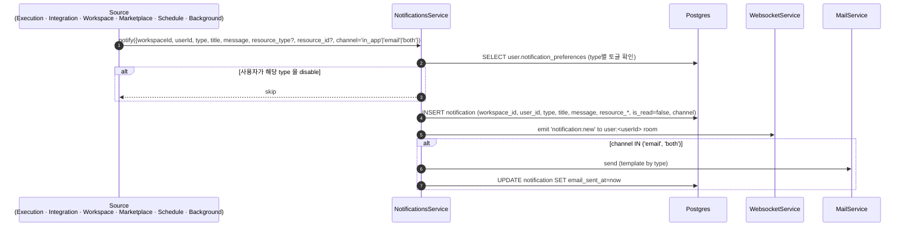
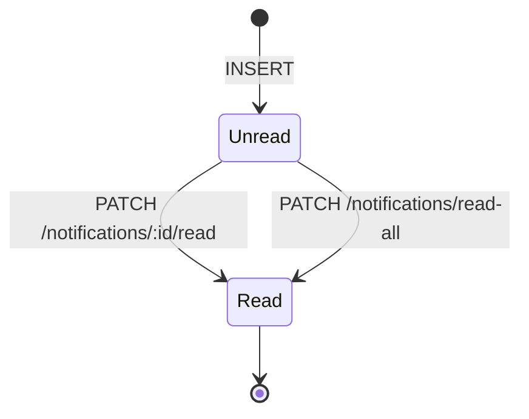

# Data Flow: 알림 (Notifications)

> 관련 spec: [Spec 알림 화면](../2-navigation/) · [데이터 모델 §2.19](../1-data-model.md) · [data-flow 개요](./0-overview.md)

---

## Overview

### System role

사용자에게 비동기 이벤트를 전달하는 단일 경로. in-app 알림 표시, 이메일 발송, WebSocket emit 을 한
표면 (`NotificationsService`) 에 모은다. 알림의 source 는 실행 실패·통합 만료·초대·마켓플레이스 업데이트·
백그라운드 실패 등 다양하지만, 모두 `notification` row 적재로 통일된다.

코드 진입점:

- `backend/src/modules/notifications/notifications.service.ts` — 적재 + 사용자 환경설정 확인 + 이메일 발송
- `backend/src/modules/notifications/notifications.controller.ts` — 목록 / 읽음 처리
- `backend/src/modules/mail/mail.service.ts` — SMTP 발송
- `backend/src/modules/websocket/websocket.service.ts` — `notification:new` emit

---

## 1. Source → Sink

### 1.1 Type 별 source · 트리거

| `type` | source | 발사 조건 |
| --- | --- | --- |
| `execution_failed` | `ExecutionEngineService` (실행 종료 시) | `execution.status='failed'`. 워크플로우 owner / 실행자에게. |
| `background_failed` | `BackgroundExecutionProcessor` | `config.notifyOnFailure=true` 인 Background 본문 실패 |
| `schedule_failed` | `ScheduleRunnerService` | 스케줄 발사 후 execution 이 즉시 실패 또는 enqueue 자체 실패 |
| `integration_expired` | `IntegrationExpiryScanner` | refresh_token 없는 provider 의 `token_expires_at` 만료(`token_expired`) **에만** 발사 (`run()` / `connected-expiry` 잡). **(2026-05-16 두 차례 갱신)** 다음 전이는 본 type 으로 알림 **미발사**: ① Cafe24 Private 24h TTL 만료 (`install_timeout`) — `expirePendingInstalls()` 가 bulk UPDATE 만 수행하고 알림 호출 없음. 사용자가 외부 흐름(Cafe24 Developers) 진행 중인 명시적 상태로, UI 배지 + 통합 상세 페이지로 통지 충분 (over-noise 방지). ② refresh 실패의 `error(auth_failed)`, transport 3회 실패의 `error(network)`, scope 부족의 `error(insufficient_scope)` — 사용자 액션 필요한 별도 도메인 알림 검토 대상. UI 배지 (사이드바 카운트, 목록 카드 뱃지, 노드 에디터 경고) 로만 통지 ([Spec 통합 §11.2](../2-navigation/4-integration.md#112-알림-생성)). 향후 `error` 도메인 알림 필요 시 `integration_action_required` 타입 신설 검토. `user.notification_preferences.integrationExpiryEmail` 토글로 채널 (in_app / both) 선택. |
| `marketplace_update` | (도입 시) 마켓플레이스 모듈 | 설치한 템플릿·에이전트의 새 버전 |
| `team_invite` | `WorkspaceInvitationsService` | 새 멤버 초대 (해당 이메일이 이미 가입자인 경우에만 in-app 알림 + 이메일 둘 다) |

---

## 2. Schema 매핑

### 2.1 Postgres

| Sink (table) | 흐름 | read/write 컬럼 | 인덱스 |
| --- | --- | --- | --- |
| `notification` | 적재 | INSERT `workspace_id, user_id, type, title, message, resource_type?, resource_id?, is_read=false, channel, email_sent_at?` (V001) | `(user_id, is_read, created_at DESC)`, `(workspace_id, created_at DESC)` (V002) |
| `notification` | 읽음 처리 | UPDATE `is_read=true` | — |
| `user` | preferences 읽기 | SELECT `notification_preferences JSONB` (V010) | — |

### 2.2 Redis / WebSocket / SMTP

| Sink | 흐름 | 비고 |
| --- | --- | --- |
| WebSocket room `user:<userId>` | `notification:new` emit | 모든 알림에 대해 즉시 |
| SMTP | type 별 이메일 템플릿 (실패 알림, 만료 알림, 초대 등) | `channel IN ('email', 'both')` 일 때 |

---

## 3. 상태 전이

이메일 발송 라이프사이클은 별도 컬럼 `email_sent_at` 으로 추적 (NULL=미발송, 채워짐=발송 완료). 발송 실패는
재시도 없이 warn log 만 (현재 구현).

---

## 4. 외부 의존

| 의존 | 방향 | 참고 |
| --- | --- | --- |
| WebSocket | 내부 emit | `WebsocketService` 단일 sink |
| SMTP | 내부 → 외부 | `MailService` |
| User preferences | preferences 확인 | `user.notification_preferences` JSONB (V010) |

---

## Rationale

### `user.notification_preferences` 를 JSONB 로 둔 이유

알림 type 이 늘어날 때마다 user 테이블 컬럼을 추가하지 않아도 되도록 JSONB 로 둔다 (V010). 현재는
`integrationExpiryEmail` 등 일부 키만 사용. 누락된 키는 default true 로 해석.

### Email 실패는 warn 만, 재시도 없음

SMTP 실패는 보통 일시 오류이지만 알림 도메인 자체에서 재시도 큐를 운영하면 복잡도가 커진다. 발송 실패가
빈번해질 경우 SMTP 외부 서비스 (예: SES) 도입과 함께 큐를 추가하는 것을 계획. 그 전까지는 `email_sent_at`
이 NULL 인 row 로 운영자가 모니터링한다.
