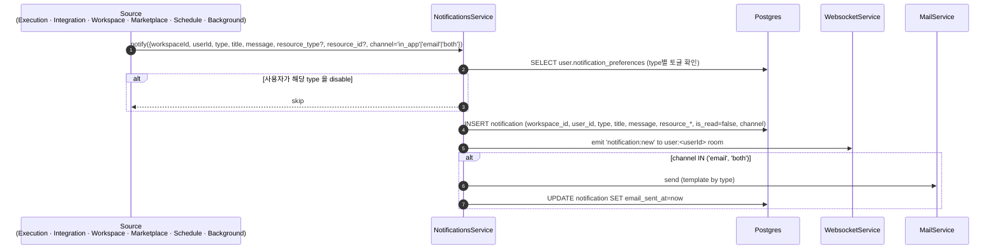
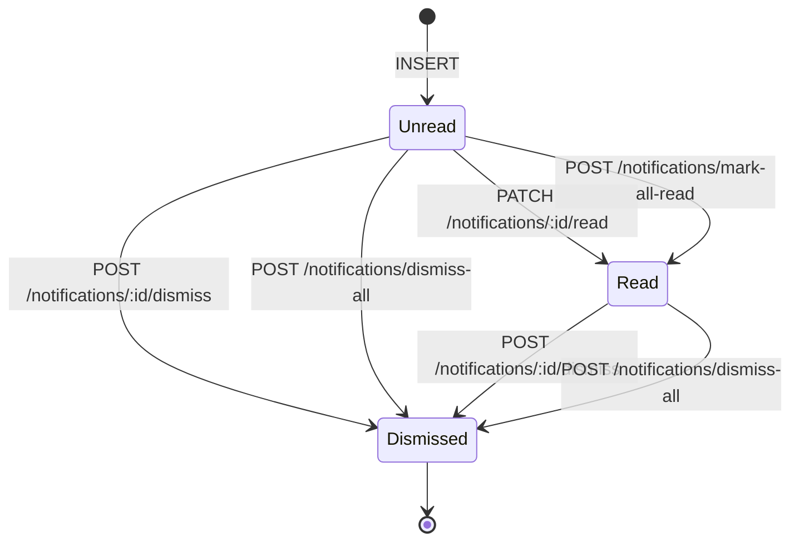

# Data Flow: 알림 (Notifications)

> 관련 spec: [Spec 알림 화면](../2-navigation/) · [데이터 모델 §2.19](../1-data-model.md) · [data-flow 개요](./0-overview.md)

---

## Overview

### System role

사용자에게 비동기 이벤트를 전달하는 단일 경로. in-app 알림 표시, 이메일 발송, WebSocket emit 을 한
표면 (`NotificationsService`) 에 모은다. 알림의 source 는 실행 실패·통합 만료·초대·마켓플레이스 업데이트·
백그라운드 실패 등 다양하지만, 모두 `notification` row 적재로 통일된다.

코드 진입점:

- `backend/src/modules/notifications/notifications.service.ts` — 적재 + 사용자 환경설정 확인 + 이메일 발송
- `backend/src/modules/notifications/notifications.controller.ts` — 목록 / 읽음 처리
- `backend/src/modules/mail/mail.service.ts` — SMTP 발송
- `backend/src/modules/websocket/websocket.service.ts` — `notification:new` emit

---

## 1. Source → Sink

### 1.1 Type 별 source · 트리거

| `type` | source | 발사 조건 |
| --- | --- | --- |
| `execution_failed` | `ExecutionEngineService` (실행 종료 시) | `execution.status='failed'`. 워크플로우 owner / 실행자에게. |
| `background_failed` | `BackgroundExecutionProcessor` | `config.notifyOnFailure=true` 인 Background 본문 실패 |
| `schedule_failed` | `ScheduleRunnerService` | 스케줄 발사 후 execution 이 즉시 실패 또는 enqueue 자체 실패 |
| `integration_expired` | `IntegrationExpiryScanner` | refresh_token 없는 provider 의 `token_expires_at` 만료(`token_expired`) **에만** 발사 (`run()` / `connected-expiry` 잡). **(2026-05-16 두 차례 갱신)** 다음 전이는 본 type 으로 알림 **미발사**: ① Cafe24 Private 24h TTL 만료 (`install_timeout`) — `expirePendingInstalls()` 가 bulk UPDATE 만 수행하고 알림 호출 없음. 사용자가 외부 흐름(Cafe24 Developers) 진행 중인 명시적 상태로, UI 배지 + 통합 상세 페이지로 통지 충분 (over-noise 방지). ② refresh 실패의 `error(auth_failed)`, transport 3회 실패의 `error(network)`, scope 부족의 `error(insufficient_scope)` — 사용자 액션 필요한 별도 도메인 알림 검토 대상. UI 배지 (사이드바 카운트, 목록 카드 뱃지, 노드 에디터 경고) 로만 통지 ([Spec 통합 §11.2](../2-navigation/4-integration.md#112-알림-생성)). 향후 `error` 도메인 알림 필요 시 `integration_action_required` 타입 신설 검토. `user.notification_preferences.integrationExpiryEmail` 토글로 채널 (in_app / both) 선택. |
| `marketplace_update` | (도입 시) 마켓플레이스 모듈 | 설치한 템플릿·에이전트의 새 버전 |
| `team_invite` | `WorkspaceInvitationsService` | 새 멤버 초대 (해당 이메일이 이미 가입자인 경우에만 in-app 알림 + 이메일 둘 다) |

---

## 2. Schema 매핑

### 2.1 Postgres

| Sink (table) | 흐름 | read/write 컬럼 | 인덱스 |
| --- | --- | --- | --- |
| `notification` | 적재 | INSERT `workspace_id, user_id, type, title, message, resource_type?, resource_id?, is_read=false, channel, email_sent_at?, dismissed_at=NULL` (V001 + dismissed_at 컬럼 추가 V055) | `(user_id, is_read, created_at DESC) WHERE dismissed_at IS NULL`, `(workspace_id, created_at DESC)` (V002 + partial 전환 V056) — 두 인덱스의 dismissed 필터 정책 차이: 사용자별 미읽음 쿼리 (벨 배지·popover) 는 visible 만 보기 때문에 partial, 워크스페이스 단위 조회는 향후 admin/감사 쿼리에서 dismissed 포함 전체 조회 여지를 두기 위해 비-partial 유지 |
| `notification` | 읽음 처리 | UPDATE `is_read=true` | — |
| `notification` | dismiss 처리 (단건) | UPDATE `dismissed_at=now()` WHERE `id=? AND user_id=? AND dismissed_at IS NULL` | — |
| `notification` | dismiss 처리 (일괄) | UPDATE `dismissed_at=now()` WHERE `workspace_id=? AND user_id=? AND dismissed_at IS NULL` | — |
| `notification` | 목록 / 카운트 조회 | SELECT `WHERE dismissed_at IS NULL` (visible 알림만) | partial index 활용 |
| `user` | preferences 읽기 | SELECT `notification_preferences JSONB` (V010) | — |

### 2.2 Redis / WebSocket / SMTP

| Sink | 흐름 | 비고 |
| --- | --- | --- |
| WebSocket room `user:<userId>` | `notification:new` emit | 모든 알림에 대해 즉시 |
| SMTP | type 별 이메일 템플릿 (실패 알림, 만료 알림, 초대 등) | `channel IN ('email', 'both')` 일 때 |

---

## 3. 상태 전이

이메일 발송 라이프사이클은 별도 컬럼 `email_sent_at` 으로 추적 (NULL=미발송, 채워짐=발송 완료). 발송 실패는
재시도 없이 warn log 만 (현재 구현).

> 위 다이어그램은 **읽음(`is_read`)** 단일 차원의 전이만 단순화해 표시한다. 실제 알림은
> `is_read` 와 `dismissed_at` 두 차원을 독립적으로 가진다 — 두 차원의 조합 표는 §4.1 참조.
> `Dismissed` 노드는 `dismissed_at IS NOT NULL` 인 상태를 통칭하며, 그 row 의 `is_read` 값은
> dismiss 시점에 무엇이었든 그대로 보존된다 (dismiss 가 자동으로 읽음을 함의하지 않는다).

---

## 4. Dismiss 흐름 (사용자 액션)

알림의 **읽음(`is_read`)** 과 **닫기(`dismissed_at`)** 는 별개 차원으로 운영된다.

### 4.1 차원 분리

| 차원 | 컬럼 | 의미 | 목록 표시 | 미읽음 카운트 |
| --- | --- | --- | --- | --- |
| 읽음 | `is_read` | 사용자가 내용을 인지했음 | 영향 없음 (visible 인 한 표시) | 차감됨 |
| 닫기 | `dismissed_at` | 사용자가 더 이상 표시되길 원치 않음 (NULL=visible, 채워짐=dismissed) | dismissed 면 제외 | dismissed 면 제외 |

조합 가능한 4 상태 (`visible` ≡ `dismissed_at IS NULL`):

- (unread, visible) — 갓 생성된 알림. 목록 표시 O, 카운트 O.
- (read, visible) — 사용자가 읽음만 표시. 목록 표시 O, 카운트 X.
- (unread, dismissed) — 안 읽었지만 닫기. 목록 표시 X, 카운트 X (사용자가 내용을 보지 않고 무시한 경우).
- (read, dismissed) — 읽고 닫음. 목록 표시 X, 카운트 X (가장 흔한 종결 상태).

> "active" 라는 어휘는 `Workflow.is_active`, `Trigger.is_active`, `Schedule.is_active` 등
> 라이프사이클 활성/비활성 의미로 이미 점유되어 있으므로, 본 spec 에서는 dismiss 차원의 활성
> 상태를 `visible` 로 일관 표기한다 (Rationale "어휘 선택 — `visible` / `dismissed`" 참조).

### 4.2 Endpoint

| Endpoint | 동작 | 권한 |
| --- | --- | --- |
| `POST /notifications/:id/dismiss` | 단건 dismiss — `UPDATE notification SET dismissed_at=now() WHERE id=:id AND user_id=:uid AND dismissed_at IS NULL`. 멱등 — 본인 소유 알림 id 면 이미 dismissed 여도 idempotent 성공으로 처리. | 본인 알림만 (다른 user 의 id 는 404 Not Found) |
| `POST /notifications/dismiss-all` | 일괄 dismiss — `UPDATE notification SET dismissed_at=now() WHERE workspace_id=:ws AND user_id=:uid AND dismissed_at IS NULL`. 응답 `{ data: { affected: number } }`. | 본인 + 현재 워크스페이스 알림만 |

응답 코드 / 본문 ([`spec/conventions/swagger.md §5`](../conventions/swagger.md#5-응답-dto-규약) 적용):

- 단건: `200 OK` with `ApiOkWrappedResponse(DismissNotificationResponseDto)`. DTO 는 `{ id: string; dismissedAt: string | null }` shape 으로, 응답에서 dismiss 시각을 그대로 반환해 클라이언트가 낙관적 업데이트를 정정 없이 반영한다.
- 일괄: `200 OK` with `ApiOkWrappedResponse(DismissAllNotificationsResponseDto)`. shape 는 `{ affected: number }` — 기존 `POST /notifications/mark-all-read` 의 `MarkAllReadResultDto` 와 동일. 두 DTO 가 동일 shape 이라도 의미가 다르므로 별도 클래스로 분리 (공통 base 또는 `PickType` 재사용은 구현 단계에서 선택).

DTO 위치 ([`spec/conventions/swagger.md §5-1`](../conventions/swagger.md#5-1-응답-dto-위치) 패턴):

- `backend/src/modules/notifications/dto/responses/dismiss-notification-response.dto.ts` (`DismissNotificationResponseDto`)
- `backend/src/modules/notifications/dto/responses/dismiss-all-notifications-response.dto.ts` (`DismissAllNotificationsResponseDto`)

### 4.3 목록·카운트에 미치는 영향

`GET /notifications` 와 `GET /notifications/unread-count` 는 **항상** `dismissed_at IS NULL` 필터를
적용한다. 사이드바 벨 배지의 미읽음 카운트도 본 정의를 따르며, dismissed 알림은 카운트되지
않는다 (옛 `is_read=false` 단순 조건 → `is_read=false AND dismissed_at IS NULL`).

dismissed 알림을 보고 싶다는 사용자 요구는 현재 없으므로 별도 query 옵션은 두지 않는다 —
필요해지면 그 시점에 `?includeDismissed=true` 옵션을 추가한다.

### 4.4 중복 방지 (`hasRecentByResource`) 와의 관계

`integration_action_required` 등에서 24h 중복 방지에 사용하는 `hasRecentByResource` 헬퍼는
**dismissed row 도 카운트한다** — 사용자가 닫았다는 사실이 알림 재발사 빈도를 다시 풀어버리면
같은 장애에 대해 사용자가 닫을 때마다 재발사되어 over-noise. 닫음은 표시 차원의 결정일 뿐,
중복 방지의 "최근 발사 여부" 와 별개. 본 결정은 의도된 것이며 향후 별도 옵션으로 분리하지
않는다 (Rationale "중복 방지에 dismissed row 포함" 참조).

### 4.5 보존 정책

dismissed 알림 row 는 즉시 삭제되지 않는다. 향후 정책으로 (a) dismissed 후 N일 경과 row 의
hard delete 배치, (b) 분석용 ETL 의 dismiss 이벤트 집계 를 도입할 수 있다 — 본 phase 의 범위 외.
현재는 row 그대로 누적되며, 정기 청소가 필요한 시점에 별도 plan 으로 추진한다.

### 4.6 WebSocket 동기화 (follow-up)

본 phase 는 같은 device 의 React Query 캐시 invalidate 로 popover 가 즉시 갱신된다. 같은 사용자의
다른 device 간 read/dismiss 동기화 (예: 한 탭에서 dismiss 한 알림이 다른 탭의 popover 에서도
즉시 사라짐) 는 [`spec/5-system/6-websocket-protocol.md §4.4`](../5-system/6-websocket-protocol.md#44-알림-이벤트-server--client)
에 `notification.read`, `notification.dismissed` 이벤트를 신설해 가능. follow-up phase 에서 검토하며,
이벤트 이름은 §4.4 기존 `notification.new` prefix 와 일관성을 유지한다.

---

## 5. 외부 의존

| 의존 | 방향 | 참고 |
| --- | --- | --- |
| WebSocket | 내부 emit | `WebsocketService` 단일 sink |
| SMTP | 내부 → 외부 | `MailService` |
| User preferences | preferences 확인 | `user.notification_preferences` JSONB (V010) |

---

## Rationale

### `user.notification_preferences` 를 JSONB 로 둔 이유

알림 type 이 늘어날 때마다 user 테이블 컬럼을 추가하지 않아도 되도록 JSONB 로 둔다 (V010). 현재는
`integrationExpiryEmail` 등 일부 키만 사용. 누락된 키는 default true 로 해석.

### Email 실패는 warn 만, 재시도 없음

SMTP 실패는 보통 일시 오류이지만 알림 도메인 자체에서 재시도 큐를 운영하면 복잡도가 커진다. 발송 실패가
빈번해질 경우 SMTP 외부 서비스 (예: SES) 도입과 함께 큐를 추가하는 것을 계획. 그 전까지는 `email_sent_at`
이 NULL 인 row 로 운영자가 모니터링한다.

### Hard delete 가 아닌 soft delete — `dismissed_at` 컬럼 (2026-05-17)

알림 popover 에 "닫기 (✕)" 액션을 도입하면서 hard delete 대신 `dismissed_at TIMESTAMPTZ NULL`
컬럼으로 soft delete 를 채택했다.

근거:

1. **감사 추적 보존** — 어떤 알림이 사용자에게 도달했고, 사용자가 어떻게 처리했는지의 기록은
   장애 사후 조사 (`integration_action_required` 에서 사용자가 실제로 인지·조치했는지, 또는
   닫고 무시했는지) 에 가치가 있다.
2. **분석 데이터** — 알림 type 별 read-rate / dismiss-rate 가 향후 알림 정책 (어떤 type 을
   email 채널로 승격할지, 어떤 type 의 임계를 조정할지) 결정 근거가 된다.
3. **"되살리기" 여지** — 사용자가 실수로 닫은 알림을 복구할 옵션을 (현재는 도입하지 않지만)
   향후 추가할 가능성이 있다. hard delete 면 불가.
4. **중복 방지 무결성** — `hasRecentByResource` 가 dismissed row 도 카운트해야 over-noise 를
   막을 수 있다 (다음 항 "중복 방지에 dismissed row 포함" 참조). hard delete 시 사용자가 닫는
   행위로 24h 가드가 풀려 같은 장애 알림이 반복 발사될 위험이 있다.

기각된 대안:

- Hard delete (`DELETE FROM notification WHERE id=?`) — 근거 1·2·3·4 모두 손실.
- `is_deleted BOOLEAN` 컬럼 — `dismissed_at` 이 시각을 동시에 보존하므로 정보량 우위.
  보존·분석 정책 (`dismissed_at` 후 N일 경과 청소) 도 시각 컬럼이 자연스럽다.
- 별도 `notification_dismissals` 테이블 — 일관성 (`is_read` 와 같은 row 안의 단일 transaction
  update) 우위가 사라지고 JOIN 비용 발생. dismiss 가 row 당 0~1 회 일어나는 1:1 관계라
  별도 테이블 가치 없음.

`(user_id, is_read, created_at DESC)` 인덱스는 **partial index** (`WHERE dismissed_at IS NULL`)
로 갱신해 목록·미읽음 카운트 쿼리에 그대로 사용된다. 활성 알림이 dismissed 알림보다 일반적으로
훨씬 적으므로 partial 인덱스 크기가 작아 부수 이점도 있다. partial 전환은 `executeInTransaction=false`
로 `CREATE INDEX CONCURRENTLY ... WHERE dismissed_at IS NULL` 후 옛 인덱스 `DROP INDEX CONCURRENTLY`
순서로 적용한다 (`(workspace_id, created_at DESC)` 인덱스는 향후 admin/감사 조회에서 dismissed
포함 전체 row 를 보는 여지를 두기 위해 partial 로 변환하지 않는다).

### 중복 방지에 dismissed row 포함 (2026-05-17)

`hasRecentByResource(workspaceId, type, resourceId, title, withinMs)` 헬퍼는 같은 (workspace,
type, resourceId, title) 조합의 최근 N ms 내 알림 존재 여부로 중복 발사를 방지한다. 본 헬퍼는
`dismissed_at IS NULL` 필터를 **적용하지 않는다** — dismissed row 를 카운트에서 빼면 사용자가
알림을 닫는 행위가 24h 가드를 풀어버려, 같은 장애 (`integration_action_required` 등) 에 대해
사용자가 닫을 때마다 재발사되는 over-noise 가 발생한다.

근거:

- dismiss 는 **표시 차원의 결정** (이 사용자가 더 이상 popover 에서 보고 싶지 않다) 이고, 중복
  방지는 **소스 차원의 결정** (같은 사건을 짧은 간격으로 다시 푸시하지 않겠다) 이다. 두 결정은
  의도가 다르므로 한 컬럼이 두 차원에 영향을 주지 않아야 한다.
- 운영 중 발생한 장애 (`auth_failed`, `network`) 가 24h 안에 자가 회복되지 않으면 사용자에게는
  여전히 액션이 필요하지만, 동일 row 가 살아있는 한 새 알림은 발사되지 않는다 (사용자가 닫았더라도).
  이 경우 24h 후 동일 row 의 `created_at` 이 cutoff 를 넘어 새 알림이 발사된다 — 자연스러운
  주기적 reminder 동작이다.

기각된 대안:

- `dismissed_at IS NULL` 필터를 헬퍼에 추가 — 위 over-noise 문제. dismiss 가 알림 발사 주기에
  사이드 이펙트를 발생시켜 의도와 어긋남.
- `hasRecentByResource` 가 row 의 `is_read` 도 무시하는 것과 동일한 원리. 두 표시 차원 (`is_read`,
  `dismissed_at`) 모두 중복 방지에 영향을 주지 않는다.

향후 별도 옵션으로 분리하지 않는다.

### 어휘 선택 — `visible` / `dismissed` (2026-05-17)

`dismissed_at IS NULL` 상태를 부르는 어휘로 후보는 `active`, `live`, `visible`, `undismissed`
였다. `Workflow.is_active`, `Trigger.is_active`, `Schedule.is_active` 등 라이프사이클 활성/비활성
의미가 이미 `is_active` 컬럼으로 점유되어 있어 `active` 는 spec 내 검색 시 의미 혼동 위험이 있다.
`live` 는 실시간 스트림 의미와 혼선. `undismissed` 는 부정형이라 가독성 손실.

`visible` 을 채택했다 — popover 에서 사용자에게 보여지는 상태라는 사용자-관점 어휘로, DB
컬럼명 `dismissed_at` 과 반대극 의미가 직관적이다. DB 컬럼명은 `dismissed_at` 그대로 유지하고
spec 본문 / API 문서 / UI 표시 어휘에 한해 `visible` 을 쓴다. UI 측에서도 `Active`/`Inactive`
배지 어휘는 의도적으로 사용하지 않는다.

### Dismiss endpoint 의 HTTP 동사 — `POST /:id/dismiss` 채택 (2026-05-17)

`DELETE /notifications/:id` / `DELETE /notifications` 도 후보였으나, 다음 이유로 `POST` 액션
endpoint 패턴을 채택했다 — 기존 `POST /notifications/mark-all-read` 와 대칭이다.

근거:

1. **코드베이스 관례 — `DELETE` = hard delete**. 코드 베이스 전반의 `DELETE` 가 hard delete
   를 의미하므로 soft delete 의 `dismissed_at` 갱신에 같은 동사를 쓰면 API 소비자가 "알림이
   사라졌다 = row 가 사라졌다" 로 오해할 위험이 있다.
2. **HTTP DELETE + response body 호환성** — 일부 HTTP 클라이언트·API 게이트웨이가 `DELETE`
   메서드의 응답 본문을 무시·제거한다. dismiss 는 응답에 `dismissedAt` 또는 `affected` 를
   포함해야 클라이언트가 낙관적 업데이트를 정정 없이 반영할 수 있다.
3. **W-48 정합성** — `plan/in-progress/20260516-full-review/RESOLUTION.md` 의 W-48 ("API 계약
   변경 — PATCH 패턴 미결") 이 미결 상태에서 `DELETE` 동사를 새 endpoint 에 도입하면 알림
   모듈의 동사 정책이 다른 모듈의 향후 결정과 어긋날 위험. POST 액션 endpoint 는 PATCH/REST
   어느 방향으로 정책이 결정되든 호환 — 보수적 선택. W-48 이 PATCH 표준화로 결론나도 본
   dismiss endpoint 는 별개 액션이므로 영향 없다 (mark-all-read 가 POST 인 것과 같은 이유).
4. **`mark-all-read` 와의 동사 대칭** — 이미 일괄 읽음 처리가 `POST /notifications/mark-all-read`
   액션 endpoint 이므로, 일괄 dismiss 도 `POST /notifications/dismiss-all` 로 통일하면
   클라이언트 SDK 가 두 액션을 동일 패턴으로 호출한다.

기각된 대안:

- `DELETE /notifications/:id` / `DELETE /notifications` — 위 1·2·3·4 위배.
- `PATCH /notifications/:id` + body `{ dismissed: true }` — 읽음 처리(`PATCH /:id/read`)와 차원이
  다른 액션을 한 endpoint 에 묶으면 의도 분기가 흐려진다. body 의 부분 갱신 의미와 액션 의미의
  혼선도 발생.

> 본 결정은 W-48 의 범위 밖이며 따로 합의를 요하지 않는다 — W-48 은 단건 상태 PATCH 패턴 (예:
> `PATCH /resource/:id` 로 status 변경) 의 표준화 미결이고, mark-all-read / dismiss-all 같은
> 일괄 액션 endpoint 는 W-48 결정과 직교한다.

### 옛 spec 의 `PATCH /notifications/read-all` 표기 정정 (2026-05-17)

옛 §3 다이어그램은 일괄 읽음 처리를 `PATCH /notifications/read-all` 로 표기했으나, 실제 구현은
`POST /notifications/mark-all-read` (현 `NotificationsController.markAllRead` `@Post('mark-all-read')`)
이다. spec 과 구현이 어긋난 오기였으며, 본 개정으로 정정한다.

`mark-all-read` 가 처음부터 `POST` 였던 원래 근거는 commit history 에 명시적 기록은 없으나,
배치 read 가 idempotent 한 "액션"(상태 update) 이라는 점에서 PATCH/POST 어느 쪽도 가능했고,
일관된 `POST /action-verb` 패턴이 NestJS 컨트롤러 구현 관례와 잘 맞아 채택된 것으로 추정.
본 dismiss endpoint 의 POST 채택도 이 패턴을 그대로 따른다.

어떤 다른 spec 파일도 `read-all` 경로를 참조하지 않음을 확인 (`grep -rn "notifications/read-all"
spec/` 단일 hit — 본 §3 다이어그램, 본 개정으로 정리).
