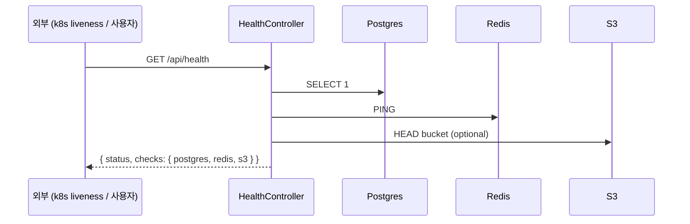
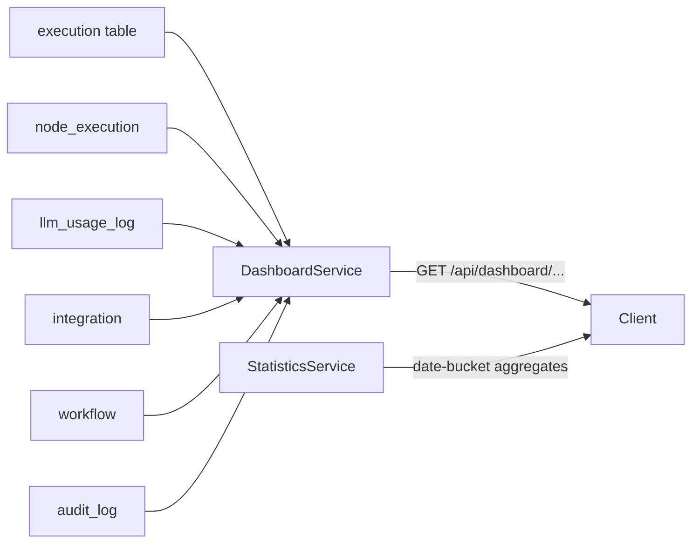
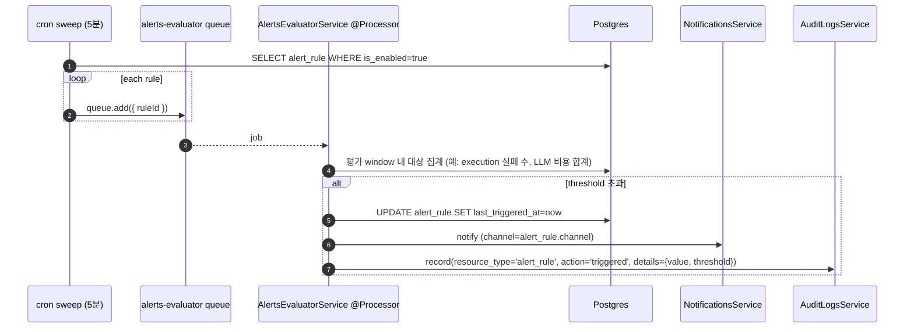

# Data Flow: 관측성 (Health · Dashboard · Statistics · Alerts)

> 관련 spec: [데이터 모델 §2 (alert_rule V016)](../1-data-model.md) · [data-flow 개요](./0-overview.md)

---

## Overview

### System role

운영 모니터링과 사용자 향 통계를 한곳에서 다룬다:

- **Health check** — 인프라 의존성 상태 확인 (`/api/health`)
- **Dashboard** — 워크스페이스 진입 화면의 KPI (워크플로우 수·실행 수·실패율·LLM 비용 등)
- **Statistics** — 시계열 통계 (실행·LLM 사용량 추이)
- **Alerts evaluator** — `alert_rule` 기반 임계치 알람을 cron 으로 평가

이 도메인은 모두 **read-mostly** — 새 row 를 만드는 측은 다른 도메인이고, 본 도메인은 그 row 들을
집계 / 평가 / 노출한다.

코드 진입점:

- `codebase/backend/src/modules/health/health.service.ts` — DB · Redis · S3 ping
- `codebase/backend/src/modules/dashboard/dashboard.service.ts` — KPI 계산
- `codebase/backend/src/modules/statistics/statistics.service.ts` — 시계열 집계
- `codebase/backend/src/modules/alerts/alerts-evaluator.service.ts` — `ALERTS_EVALUATOR_QUEUE` cron + processor
- `codebase/backend/src/modules/alerts/alerts.service.ts` — alert_rule CRUD

---

## 1. Source → Sink

### 1.1 Health check

DB 적재 없음 — 매 호출이 stateless.

### 1.2 Dashboard / Statistics

이 도메인은 본인 명의 테이블 없이 다른 도메인의 데이터를 aggregate 한다.

### 1.3 Alerts evaluator

---

## 2. Schema 매핑

### 2.1 Postgres

| Sink (table) | 흐름 | read/write 컬럼 | 인덱스 |
| --- | --- | --- | --- |
| `alert_rule` | CRUD | INSERT/UPDATE `workspace_id, workflow_id?, type (예: execution_failure_rate / llm_cost), threshold NUMERIC(12,4), window_iso (ISO 8601 duration, default 'PT1H'), channel ('in_app' default), is_enabled, last_triggered_at?, created_by?` (V016) | `idx_alert_rule_workspace (workspace_id)` |
| `audit_log` | 알람 발사 | INSERT (action='alert_rule.triggered') | downstream |
| `notification` | 알람 발사 | INSERT (type 별 후속) | downstream |

읽기만 하는 테이블 (Dashboard / Statistics):

| Source | 집계 종류 |
| --- | --- |
| `execution` | 전체 실행 수, 실패 수, 평균 duration |
| `node_execution` | 노드 유형별 실행 횟수 |
| `llm_usage_log` | 모델·기간별 토큰·비용 |
| `integration` | 상태별 카운트 (`(workspace_id, status)` 인덱스 활용) |
| `workflow` | 활성 / 비활성 카운트 |

### 2.2 Redis (BullMQ)

| 큐 | producer | consumer | payload |
| --- | --- | --- | --- |
| `alerts-evaluator` | `AlertsEvaluatorService` cron | 동일 service (`@Processor`) | `{ ruleId }` (`alerts-evaluator.service.ts:13`) |

### 2.3 외부

없음.

---

## 3. 상태 전이

상태 머신은 없다. `alert_rule.is_enabled` 토글만 존재. `last_triggered_at` 은 마지막 발사 추적용으로
중복 알람 억제 (debounce) 에 사용 — 윈도우 안에 이미 발사된 rule 은 다시 발사하지 않는다.

---

## 4. 외부 의존

| 의존 | 방향 | 참고 |
| --- | --- | --- |
| Execution | read | dashboard / alert source |
| LLM Usage | read | dashboard / alert source |
| Integration | read | dashboard 상태 배지 |
| Notifications | downstream | 알람 발사 시 |
| Audit | downstream | 알람 발사 기록 |

---

## Rationale

### Health check 의 S3 ping 은 optional

S3 ping 은 외부 네트워크 의존이 강해 health check 가 느려질 수 있다. liveness probe 는 빠르게 끝나야
하므로 S3 는 readiness 단계 또는 별도 endpoint 로 분리하는 것을 권장 (현재 구현은 비동기 best-effort).

### `window_iso` 를 ISO 8601 duration 으로 둔 이유

`PT1H`, `PT15M`, `P1D` 등 직관적이고 timezone 영향이 없다. cron-parser / dayjs 같은 라이브러리가 모두
파싱 가능. 미래에 더 복잡한 윈도우 (예: business hours) 가 필요해질 때 표준 위에서 확장 가능.

### Dashboard 가 정규화된 별도 테이블을 두지 않는 이유

현재 워크스페이스 규모에서는 매 요청마다 raw 테이블 (`execution`, `llm_usage_log`) 을 집계해도 충분하다.
크기가 커지면 시간 단위 pre-aggregated table (`statistics_hourly`) 를 추가하고 daily batch 로 채우는
방향을 검토 (P2+).
