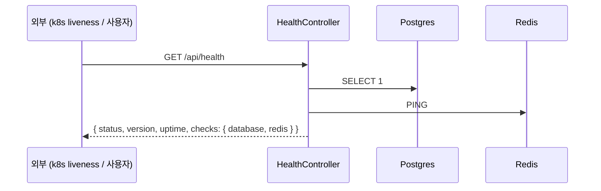
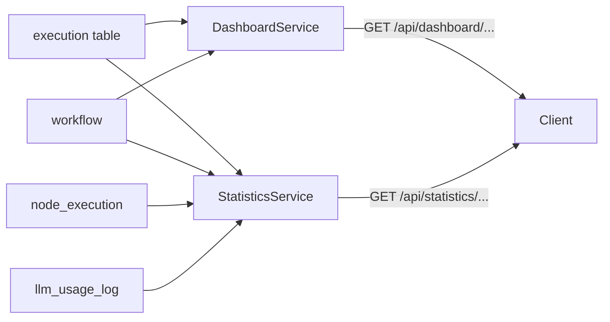
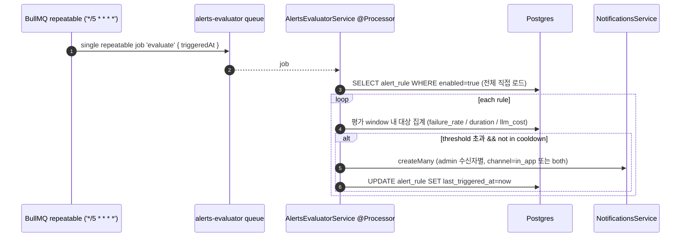
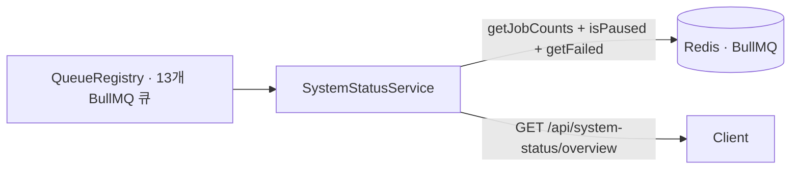

# Data Flow: 관측성 (Health · Dashboard · Statistics · Alerts · System Status)

> 관련 spec: [데이터 모델 §2 (alert_rule V016)](../1-data-model.md) · [data-flow 개요](./0-overview.md)

---

## Overview

### System role

운영 모니터링과 사용자 향 통계를 한곳에서 다룬다:

- **Health check** — 인프라 의존성 상태 확인 (`/api/health`)
- **Dashboard** — 워크스페이스 진입 화면의 KPI (워크플로우 수·활성 워크플로우 수·최근 7일 실행 수와 전주 대비 변화율·성공률·평균 실행 시간 — `DashboardSummary`, `dashboard.service.ts`). LLM 비용은 Dashboard summary 가 아닌 Statistics 영역
- **Statistics** — 기간·워크플로우 필터 기반 집계 API surface: `summary` / `executions`(일자별 추이) / `errors`(워크플로우별 오류) / `top-workflows` / `node-stats` / `llm-usage/summary`·`llm-usage/timeseries` / `export`(JSON·CSV) (`statistics.controller.ts`). 화면 spec 은 [통계 화면](../2-navigation/7-statistics.md)
- **Alerts evaluator** — `alert_rule` 기반 임계치 알람을 cron 으로 평가

이 도메인은 모두 **read-mostly** — 새 row 를 만드는 측은 다른 도메인이고, 본 도메인은 그 row 들을
집계 / 평가 / 노출한다.

코드 진입점:

- `codebase/backend/src/modules/health/health.service.ts` — DB · Redis · S3 ping
- `codebase/backend/src/modules/dashboard/dashboard.service.ts` — KPI 계산
- `codebase/backend/src/modules/statistics/statistics.service.ts` — 시계열 집계
- `codebase/backend/src/modules/alerts/alerts-evaluator.service.ts` — `ALERTS_EVALUATOR_QUEUE` BullMQ repeatable(`*/5 * * * *`) + 통합 `@Processor`
- `codebase/backend/src/modules/alerts/alerts.service.ts` — alert_rule CRUD

---

## 1. Source → Sink

### 1.1 Health check

DB 적재 없음 — 매 호출이 stateless. 현재 구현(`health.service.ts:53-88`)은 `database`(SELECT 1)·
`redis`(ping) 두 의존만 점검한다. 응답 객체는 `{ status, version, uptime, checks }` 이고
`checks` 키는 `database` / `redis` 다. Redis config 누락 시 `redis.status='unconfigured'` 로 degrade 하며
이 경우 전체 `status` 는 `unhealthy`. **S3 ping 은 미구현 (Planned)** — 아래 Rationale 참고.

### 1.2 Dashboard / Statistics

이 도메인은 본인 명의 테이블 없이 다른 도메인의 데이터를 aggregate 한다. 읽기 범위는 서비스별로
다르다 — `DashboardService` 는 `workflow`·`execution` 레포지토리만 주입하고
(`dashboard.service.ts`), `node_execution`·`llm_usage_log` 는 `StatisticsService` 가 읽는다
(`statistics.service.ts`). `integration` 테이블은 두 모듈 어디에서도 읽지 않는다.

### 1.3 Alerts evaluator

`onModuleInit` 이 `queue.upsertJobScheduler` 로 **단일 repeatable job**(`'alerts-evaluator-5min'`,
name `'evaluate'`, payload `{ triggeredAt }`)을 등록한다 — per-rule 큐잉이 아니다. processor 의 `run()` 이
`enabled=true` rule 전체를 직접 로드해 순회 평가한다 (`alerts-evaluator.service.ts:58-103`). cooldown 은
`lastTriggeredAt` 으로 윈도우 내 재발사를 억제한다. 발사 시 알림(`notificationsService.createMany`,
수신자는 워크스페이스 admin)과 `last_triggered_at` 업데이트만 수행하며 **audit_log 기록은 없다**
(`dispatchBreach`, `alerts-evaluator.service.ts`).

평가·발사 세부 정책 (`alerts-evaluator.service.ts`):

- **최소 표본 가드** — `failure_rate` 는 윈도우 내 총 실행이 **5건 미만**이면 평가를 생략한다
  (`computeFailureRate` 의 `total < 5 → null`). 1/1 실패가 50% rule 을 트립하지 않게 하는
  소표본 노이즈 억제로, "알람이 안 울리는" 사용자 가시 동작의 원인이 될 수 있다.
- **breach 판정은 strict 초과** — `observed <= threshold` 면 미발사 (`evaluateRule`). 임계값과
  정확히 같은 관측치는 알람을 울리지 않는다.
- **window 파싱 fallback** — `rule.window` 는 자체 minimal regex 파서(`parseIso8601Duration`,
  `P?D`/`PT?H?M?S` 조합 지원)로 해석하며, 파싱 불가 문자열이면 **묵묵히 1시간(PT1H)으로
  fallback** 한다. DTO 의 `window` 는 `@IsString` 만 검증하므로 임의 문자열이 저장될 수 있고,
  그 경우 이 fallback 이 실효 동작을 결정한다 (`alert-rule.dto.ts`).
- **channel 매핑** — `alert_rule.channel='email'` 발사 시 실제 notification channel 은
  `'both'`(in_app+email)로 매핑된다 (`dispatchBreach`). email-only 발송 경로는 없다.

### 1.4 System Status (큐 집계)

`SystemStatusService` 는 본인 명의 테이블·job payload 를 읽지 않고, 13개 큐의 상태별 카운트(`getJobCounts`)와 `isPaused` 를 집계하고, 추가로 `getFailed()` 역순 페이지 스캔으로 최근 윈도우 내 실패 수 `recentFailed`(스캔 캡 도달 시 하한값 표기)를 계산해 셋을 함께 health 파생(`deriveHealth`)에 사용한다 (`system-status.service.ts`). 윈도우·캡·임계는 env 로 튜닝 가능 — `SYSTEM_STATUS_FAILED_WINDOW_MINUTES`(기본 60)·`SYSTEM_STATUS_FAILED_SCAN_CAP`(기본 1000)·`SYSTEM_STATUS_FAILED_THRESHOLD`·`SYSTEM_STATUS_DELAYED_THRESHOLD` (`system-status.constants.ts`, 상세 SoT 는 16-system-status-api.md). 워크스페이스 경계 없는 시스템 전역 집계이며, 개별 job 식별자·payload 는 노출하지 않는다. 큐 목록 SoT 는 [`0-overview.md §4`](./0-overview.md#4-bullmq-큐-카탈로그), API 상세는 [`5-system/16-system-status-api.md`](../5-system/16-system-status-api.md).

---

## 2. Schema 매핑

### 2.1 Postgres

| Sink (table) | 흐름 | read/write 컬럼 | 인덱스 |
| --- | --- | --- | --- |
| `alert_rule` | CRUD | INSERT/UPDATE `workspace_id, workflow_id?, type ('failure_rate' \| 'duration' \| 'llm_cost'), threshold NUMERIC(12,4), window_iso (ISO 8601 duration, default 'PT1H'), channel ('in_app' \| 'email', default 'in_app'), enabled, last_triggered_at?, created_by?` (V016) | `idx_alert_rule_workspace (workspace_id)`, `idx_alert_rule_enabled (enabled) WHERE enabled=true` (partial) |
| `notification` | 알람 발사 | INSERT (`createMany`, type=`alert_<type>`, resource_type='alert_rule') | downstream |

읽기만 하는 테이블 (Dashboard / Statistics):

| Source | 읽는 서비스 | 집계 종류 |
| --- | --- | --- |
| `execution` | Dashboard·Statistics | 전체 실행 수, 실패 수, 성공률, 평균 duration |
| `node_execution` | Statistics | 노드별 실행 횟수·평균 시간·오류율 |
| `llm_usage_log` | Statistics | 모델·기간별 토큰·비용 |
| `workflow` | Dashboard·Statistics | 활성 / 비활성 카운트, 워크플로 join |

### 2.2 Redis (BullMQ)

| 큐 | producer | consumer | payload |
| --- | --- | --- | --- |
| `alerts-evaluator` | `AlertsEvaluatorService` (`onModuleInit` repeatable scheduler) | 동일 service (`@Processor`) | `{ triggeredAt }` (`alerts-evaluator.service.ts:15-17,58-65`) |

### 2.3 외부

없음.

---

## 3. 상태 전이

상태 머신은 없다. `alert_rule.enabled` 토글만 존재. `last_triggered_at` 은 마지막 발사 추적용으로
중복 알람 억제 (cooldown) 에 사용 — 윈도우 안에 이미 발사된 rule 은 다시 발사하지 않는다
(`isInCooldown`, `alerts-evaluator.service.ts:192-195`).

---

## 4. 외부 의존

| 의존 | 방향 | 참고 |
| --- | --- | --- |
| Execution | read | dashboard / statistics / alert source |
| LLM Usage | read | statistics / alert source |
| Workspaces | read | 알람 수신자(admin) 조회 |
| Notifications | downstream | 알람 발사 시 (`createMany`) |

---

## Rationale

### Health check 의 S3 ping 은 미구현 (Planned)

S3 ping 은 외부 네트워크 의존이 강해 health check 가 느려질 수 있다. liveness probe 는 빠르게 끝나야
하므로 S3 는 readiness 단계 또는 별도 endpoint 로 분리하는 것을 권장한다. **현재 구현(`health.service.ts`)은
`database`·`redis` 만 점검하고 S3 점검은 포함하지 않는다 (미구현).**

### `window_iso` 를 ISO 8601 duration 으로 둔 이유

`PT1H`, `PT15M`, `P1D` 등 직관적이고 timezone 영향이 없다. 미래에 더 복잡한 윈도우
(예: business hours) 가 필요해질 때 표준 위에서 확장 가능. 다만 현재 구현은 외부 라이브러리가
아닌 **자체 minimal regex 파서**(`parseIso8601Duration`, `alerts-evaluator.service.ts`)로 일/시/분/초
조합만 해석하며, 파싱 실패 시 PT1H 로 fallback 한다 (§1.3). window 입력을 ISO 8601 패턴으로
DTO 단에서 검증할지는 별도 plan 으로 다룬다.

### `failure_rate` 최소 표본 5건 가드를 둔 이유

윈도우 내 실행이 극소수일 때 비율 지표는 노이즈가 크다 — 1건 중 1건 실패(100%)가 50% rule 을
트립하면 알람 신뢰도가 무너진다. 표본 5건 미만이면 평가를 생략해 소표본 노이즈를 억제한다.
대가로 저빈도 워크플로의 실패는 비율 알람으로 잡히지 않을 수 있다 (§1.3 의 사용자 가시 정책).

### Dashboard 가 정규화된 별도 테이블을 두지 않는 이유

현재 워크스페이스 규모에서는 매 요청마다 raw 테이블 (`execution`, `llm_usage_log`) 을 집계해도 충분하다.
크기가 커지면 시간 단위 pre-aggregated table (`statistics_hourly`) 를 추가하고 daily batch 로 채우는
방향을 검토 (P2+).
