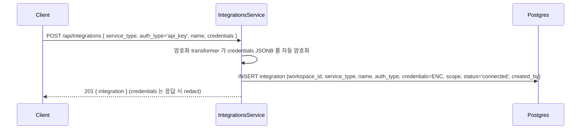
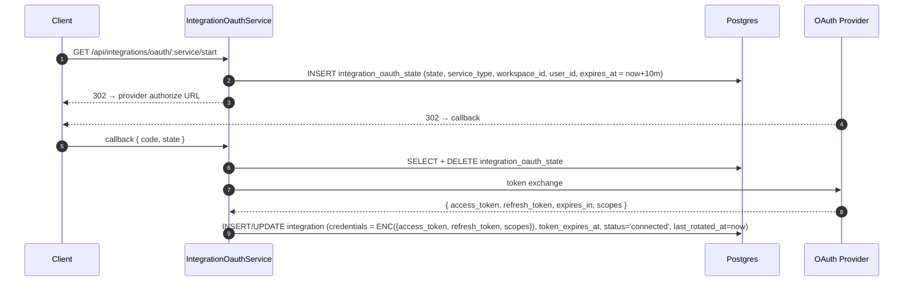
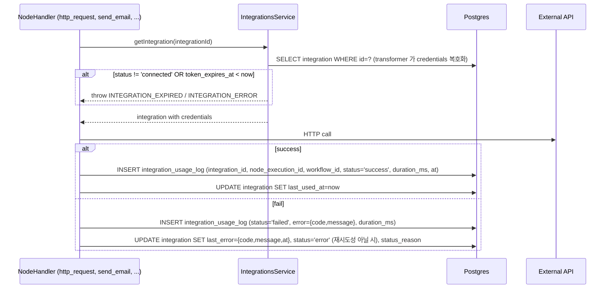
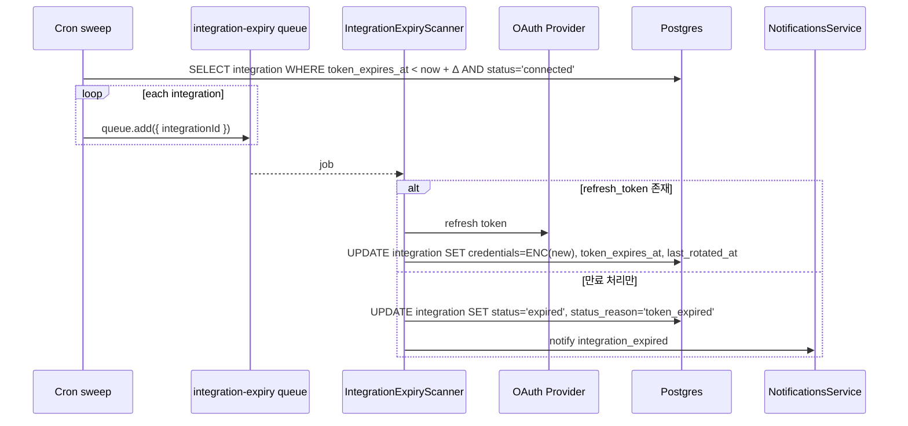
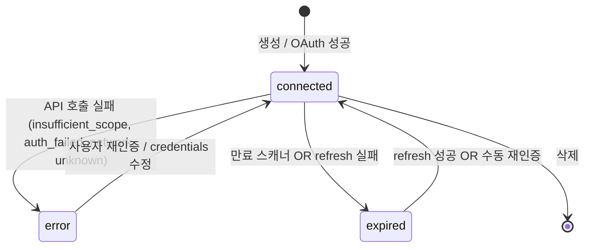

# Data Flow: 외부 통합 (Integration)

> 관련 spec: [Spec 통합 화면](../2-navigation/4-integration.md) · [데이터 모델 §2.10, §2.10.1](../1-data-model.md) · [data-flow 개요](./0-overview.md)

---

## Overview

### System role

외부 SaaS (Google·GitHub 등) 와 통신하기 위한 인증 정보·연결 상태를 저장한다. 노드 실행 시점에 해당
integration 의 credentials 를 가져와 외부 API 호출에 사용하고, 호출 결과는 `integration_usage_log`
에 기록한다. OAuth 토큰은 별도 만료 스캐너가 주기적으로 점검해 `expired` 로 마킹하거나 refresh 한다.

코드 진입점:

- `backend/src/modules/integrations/integrations.service.ts` — CRUD
- `backend/src/modules/integrations/integration-oauth.service.ts` — OAuth start / callback
- `backend/src/modules/integrations/integration-expiry-scanner.service.ts` — 만료 스캐너
- `backend/src/modules/integrations/services/credentials-transformer.ts` — `credentials` JSONB 의 AES 암호화 (entity column transformer)

---

## 1. Source → Sink

### 1.1 Integration 생성 (API Key)

### 1.2 OAuth 연결

### 1.3 노드 실행에서 호출

### 1.4 OAuth 만료 스캐너 (BullMQ `integration-expiry`)

---

## 2. Schema 매핑

### 2.1 Postgres

| Sink (table) | 흐름 | read/write 컬럼 | 인덱스 / 제약 |
| --- | --- | --- | --- |
| `integration` | 생성·갱신 | `workspace_id, service_type, name, auth_type, credentials (encrypted JSONB), scope, status, status_reason, token_expires_at, last_used_at, last_rotated_at, last_error, created_by` | `(workspace_id, name) UNIQUE` (V008/V001), `(workspace_id, status)` 배지 카운트, `(workspace_id, service_type)`, `(token_expires_at)` 스캐너용 (V009) |
| `integration_usage_log` | 노드 실행 후 | INSERT `integration_id, node_execution_id, workflow_id, status, error?, duration_ms, at` | V008 `(integration_id, at DESC)`. 보존 90일 일일 배치 정리 |
| `integration_oauth_state` | OAuth start | INSERT `state, service_type, workspace_id, user_id, expires_at = now+10m` | one-shot DELETE on callback. `state UNIQUE` (V009) |

### 2.2 Redis

| 큐 | producer | consumer | payload |
| --- | --- | --- | --- |
| `integration-expiry` | `IntegrationExpiryScanner` cron sweep | 동일 module 내 processor | `{ integrationId, reason }` |

### 2.3 외부

| Sink | 흐름 |
| --- | --- |
| OAuth provider | authorize / token / refresh |
| Service API | 노드 실행 본체 호출 (Google API, GitHub API, HTTP, ...) |

---

## 3. 상태 전이

### 3.1 `integration.status`

### 3.2 `status_reason` 매핑

| status | status_reason 후보 |
| --- | --- |
| `error` | `insufficient_scope`, `auth_failed`, `network`, `unknown` |
| `expired` | `token_expired`, `refresh_failed` |
| `connected` | NULL |

---

## 4. 외부 의존

| 의존 | 방향 | 참고 |
| --- | --- | --- |
| Execution 도메인 | cross-ref | 노드 실행 진입점 — `http_request`, `database_query`, `send_email` |
| Notifications | cross-ref | `integration_expired` 알림 |
| Audit | cross-ref | `integration.create/update/delete` 액션 |

---

## Rationale

### `credentials` JSONB AES 암호화

평문 저장 시 DB dump / replica 가 노출되면 외부 시스템 자격증명이 통째로 새어 나간다. TypeORM
`transformer` (`credentials-transformer.ts`) 를 column 단에서 적용해 ORM 경계에서 자동으로 암호화/복호화한다.
응답 직렬화 시 controller / DTO 단에서 `credentials` 필드를 redact 한다.

### `last_error` 도 암호화

OAuth 응답 본문에 token 일부가 포함될 수 있어 `last_error` 도 동일 transformer 로 암호화한다
(`integration.entity.ts:71~77`).

### `integration_usage_log` 보존 90일

상세 페이지의 "Recent activity" 는 최근 30~90일 데이터만 의미가 있다. 90일 이상 누적되면 row 수가
폭증하고 검색 성능이 떨어지므로 일일 배치로 정리한다 (`spec/1-data-model.md §2.10.1`).
