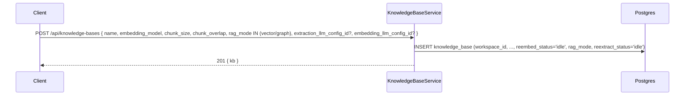
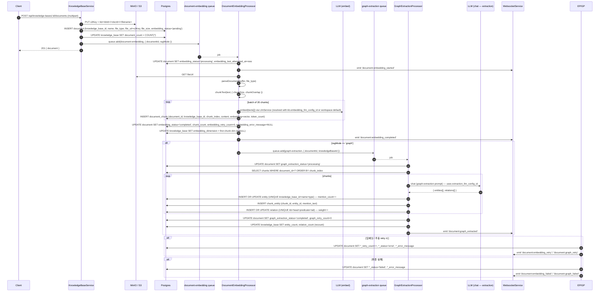
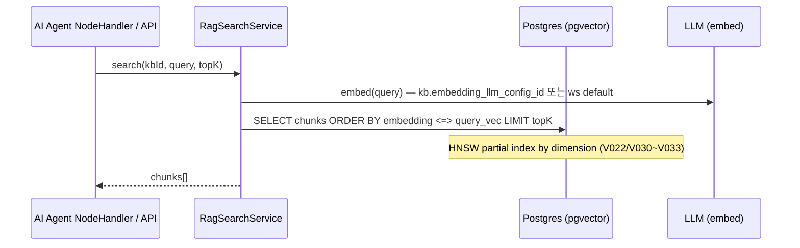
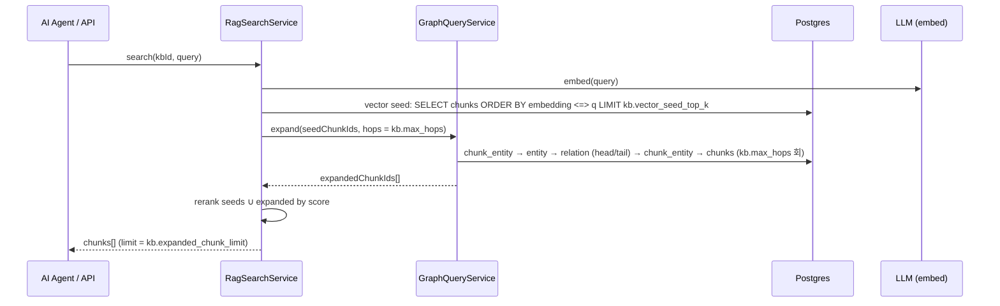
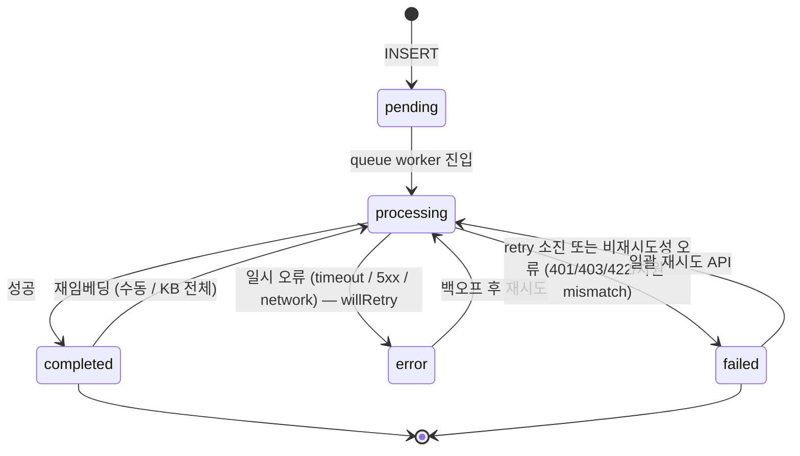

# Data Flow: Knowledge Base & RAG

> 관련 spec: [Spec 임베딩 파이프라인](../5-system/8-embedding-pipeline.md) · [Spec RAG 검색](../5-system/9-rag-search.md) · [Spec Graph RAG](../5-system/10-graph-rag.md) · [데이터 모델 §2.11~§2.12.4](../1-data-model.md) · [data-flow 개요](./0-overview.md)

---

## Overview

### System role

AI Agent 가 참조하는 문서 지식을 수집·청크·임베딩·검색하는 파이프라인. 두 가지 모드 (`vector` /
`graph`) 를 지원하며 KB 생성 시점에 모드가 결정된다 (이후 불변). Graph 모드는 임베딩 완료 후
chained dispatch 로 entity/relation 추출까지 이어진다. 검색 시점에는 vector seed → 그래프 확장 →
rerank 의 Hybrid 흐름.

코드 진입점:

- `backend/src/modules/knowledge-base/knowledge-base.service.ts` — KB / Document CRUD + S3 업/다운로드
- `backend/src/modules/knowledge-base/embedding/embedding.service.ts` — 문서 → 청크 → 임베딩
- `backend/src/modules/knowledge-base/graph/graph-extraction.service.ts` — chunk → entity/relation 추출
- `backend/src/modules/knowledge-base/graph/graph-query.service.ts` — 그래프 확장
- `backend/src/modules/knowledge-base/search/rag-search.service.ts` — vector / graph RAG 검색
- `backend/src/modules/knowledge-base/queues/*.ts` — BullMQ 큐 (document-embedding, graph-extraction)

---

## 1. Source → Sink

### 1.1 KB 생성

### 1.2 문서 업로드 → 임베딩 → (graph 모드면) 그래프 추출

### 1.3 RAG 검색 (vector 모드)

### 1.4 RAG 검색 (graph 모드)

### 1.5 재임베딩 / 재추출

| 액션 | API | 동작 |
| --- | --- | --- |
| 문서 단건 재임베딩 | `POST /api/knowledge-bases/:id/documents/:docId/re-embed` | `document-embedding` queue 에 `reEmbed=true` 로 enqueue. 기존 chunks DELETE 후 처음부터. |
| KB 전체 재임베딩 | `POST /api/knowledge-bases/:id/re-embed` | `reembed_status` atomic CAS `idle → in_progress`. 실패 시 409. `addBulk` 로 모든 문서 enqueue (`isKbBatch=true`). 마지막 child 가 finalize 에서 `reembed_status='idle'` reset 및 `embedding_dimension=NULL` reset. |
| 문서 단건 재추출 | `POST /api/knowledge-bases/:id/documents/:docId/re-extract` | `graph-extraction` queue 에 enqueue. graph 모드 KB 만 허용. |
| KB 전체 재추출 | `POST /api/knowledge-bases/:id/re-extract` | `reextract_status` CAS. 모든 문서 `addBulk`. 모든 entity / relation / chunk_entity DELETE 후 다시 채움. |
| Stuck 회수 | `StuckDocumentRecoveryService` cron | `embedding_last_attempted_at` 가 임계보다 오래된 `processing/pending` 문서를 `error` 로 마킹 후 큐에 다시 push. |

---

## 2. Schema 매핑

### 2.1 Postgres

| Sink (table) | 흐름 | 핵심 컬럼 | 인덱스 / 제약 |
| --- | --- | --- | --- |
| `knowledge_base` | 생성 | `workspace_id, name, embedding_model, embedding_dimension?, chunk_size, chunk_overlap, document_count, reembed_status, rag_mode, extraction_llm_config_id?, embedding_llm_config_id? (V029), max_hops, vector_seed_top_k, expanded_chunk_limit, entity_count, relation_count, reextract_status` | FK CASCADE on `workspace_id` |
| `knowledge_base` | 임베딩 완료 시 | UPDATE `embedding_dimension`(첫 임베딩), `document_count` | NULL reset 은 KB 전체 재임베딩 진입 시 (V021) |
| `document` | 업로드 | INSERT `knowledge_base_id, name, file_type IN (txt/md/pdf/csv), file_url, file_size, embedding_status='pending', tags='{}', metadata={}` | FK CASCADE on `knowledge_base_id` |
| `document` | 임베딩 라이프사이클 | UPDATE `embedding_status, embedding_retry_count, embedding_last_attempted_at, embedding_error_message, chunk_count` | V037 `embedding_status` CHECK 갱신, V039 legacy CHECK drop |
| `document` | 그래프 라이프사이클 | UPDATE `graph_extraction_status, graph_retry_count, graph_last_attempted_at, graph_error_message` | V025/V026 |
| `document` | retry 재시도 인덱스 | — | V038 partial index on `embedding_status IN (error, failed)` 등 stuck 회수용 |
| `document_chunk` | 임베딩 적재 | INSERT `document_id, knowledge_base_id, chunk_index, content, embedding (vector), token_count, metadata` | `(document_id, chunk_index) UNIQUE`. HNSW partial indexes per dimension (V022 768, V030 384/512/1024, V031 1536, V032 512, V033 1024) — `embedding_dimension` 별로 매칭된 index 가 검색에 활용. V023 halfvec 인덱스는 3072 차원 처리. |
| `entity` | graph 추출 | INSERT/UPDATE `knowledge_base_id, name, display_name, type IN (person/organization/concept/location/event/other), description?, mention_count, last_seen_chunk_id?` | `(knowledge_base_id, name, type) UNIQUE`, V025 `idx_entity_kb_type`, `idx_entity_kb_mention (mention_count DESC)` |
| `relation` | graph 추출 | INSERT/UPDATE `knowledge_base_id, head_entity_id, tail_entity_id, predicate, evidence_chunk_id?, weight` | `(kb, head, predicate, tail) UNIQUE` (V025), V027 `(kb, head)` / `(kb, tail)` 인덱스 |
| `chunk_entity` | graph 추출 | INSERT `chunk_id, entity_id, mention_text?` | PK `(chunk_id, entity_id)`, V025 `(entity_id)` 역방향 인덱스 |
| `chunk_entity` / `entity` / `relation` | KB 재추출 | DELETE all (CASCADE via knowledge_base_id) before re-populate | — |

### 2.2 Redis (BullMQ)

| 큐 | producer | consumer | payload |
| --- | --- | --- | --- |
| `document-embedding` | KB 문서 업로드 / 재임베딩 API / stuck recovery | `DocumentEmbeddingProcessor` (concurrency 3) | `{ documentId, reEmbed?, isKbBatch?, knowledgeBaseId?, ragMode? }` (`document-embedding.queue.ts`) |
| `graph-extraction` | `DocumentEmbeddingProcessor.onCompleted` (chained), 재추출 API | `GraphExtractionProcessor` (concurrency 2 — LLM rate limit) | `{ documentId, knowledgeBaseId, isKbBatch? }` (`graph-extraction.queue.ts`) |

### 2.3 S3 / MinIO

| Bucket / prefix | 흐름 | 비고 |
| --- | --- | --- |
| `<bucket>/kb/<kbId>/<docId>/<filename>` | 업로드 시 PUT, 임베딩 시 GET, 문서 삭제 시 DELETE | 코드 기준: `knowledge-base.service.ts:723`. `spec/0-overview.md §2.7` 의 `{workspaceId}/knowledge-base/...` 와 다름 (data-flow/0-overview Rationale 참고) |

### 2.4 외부

| Sink | 흐름 | 비고 |
| --- | --- | --- |
| LLM provider (embed) | 임베딩 / 검색 query embed | `LlmService.embed`. 사용량 → [`llm-usage.md`](./llm-usage.md) |
| LLM provider (chat) | graph 추출 prompt | `LlmService.chat` with `extraction_llm_config_id` 또는 ws default |

### 2.5 WebSocket

| Event | 발행 |
| --- | --- |
| `document:embedding_started/completed/failed/retry` | `EmbeddingService.emitEvent` |
| `document:graph_started/completed/failed/retry` | `GraphExtractionService.emitEvent` |
| `kb:reembed_started/finished`, `kb:reextract_started/finished` | KB-level batch finalize 시 |

---

## 3. 상태 전이

### 3.1 `document.embedding_status` (graph_extraction_status 도 동일 의미)

- 재시도 정책: `attempt=0` (1차) → 백오프 1s/4s/16s + ±30% jitter, 최대 3회 (`embedding.service.ts:21~23`)
- `embedding_retry_count` 는 모든 attempt 실패마다 누적. 성공 시 0 reset.
- 2차+ attempt 는 `reEmbed=true` 강제로 부분 INSERT chunk 정리 (idempotency).

### 3.2 `knowledge_base.reembed_status` / `reextract_status`

| 상태 | 진입 / 종료 |
| --- | --- |
| `idle` | default. CAS `idle → in_progress` 로 진입 |
| `in_progress` | KB 전체 재임베딩/재추출 진행 중. 동일 동작 재실행 시 409. 마지막 child job 의 finalize 가 `idle` 로 reset. |

---

## 4. 외부 의존

| 의존 | 방향 | 참고 |
| --- | --- | --- |
| LLM 도메인 | 외부 | embed / chat 호출, `llm_config_id` 해석 |
| LLM Usage | cross-ref | 모든 LLM 호출은 `llm_usage_log` 적재 — [`llm-usage.md`](./llm-usage.md) |
| File Storage | cross-ref | KB 가 S3 의 유일한 production 사용처 — [`file-storage.md`](./file-storage.md) |
| Execution 도메인 | cross-ref | AI Agent 노드가 KB tool 로 RAG 검색 호출 |

---

## Rationale

### `rag_mode` 가 생성 시 불변

vector / graph 는 같은 `document_chunk` table 을 공유하지만 graph 모드는 추가로 `entity / relation /
chunk_entity` 를 채운다. 모드 전환을 사후에 허용하면 (예: vector → graph) 모든 청크에 대해 추출을 다시
돌려야 하고, 그 동안 검색 일관성이 깨진다. P0~P2 에서는 생성 시 결정 / 불변 으로 단순화했다
(`spec/5-system/10-graph-rag.md`).

### chained dispatch (embedding → graph) 의 이유

graph 모드 KB 에서 새 문서가 임베딩되자마자 entity/relation 추출까지 자동으로 이어지는 게 자연스러운
UX 다. `DocumentEmbeddingProcessor.onCompleted` 에서 `graph-extraction` 큐에 자동 enqueue 하면
사용자가 추가 API 를 호출하지 않아도 된다 (`graph-extraction.queue.ts` 주석). 큐를 분리한 이유는
graph 추출이 LLM chat (느림·rate limit 빡빡) 인 반면 embedding 은 embed API (빠름·throughput 크다)
라 concurrency 정책이 달라야 하기 때문이다 (embedding=3, graph=2).

### HNSW partial index 분리

`embedding_dimension` 이 KB 마다 다르다 (provider/모델별 384, 512, 768, 1024, 1536, 3072 …). 단일
인덱스에 다 차원 vector 가 섞이면 검색이 비효율적이므로 V022/V030~V033 으로 차원별 partial HNSW
인덱스를 분리했다. 3072 차원은 pgvector 제약으로 raw vector 가 HNSW 에 못 들어가 V023 의 halfvec
인덱스를 사용한다.

### S3 key 패턴의 코드/spec 불일치

`spec/0-overview.md §2.7` 은 `{workspaceId}/knowledge-base/{kbId}/{documentId}_{filename}` 을
제안하지만 현재 코드는 `kb/{kbId}/{docId}/{filename}` 으로 업로드한다. data-flow 는 코드 기준으로
기재하고, 정합성 정리는 별도 plan 으로 분리 ([`file-storage.md`](./file-storage.md) Rationale 참고).
