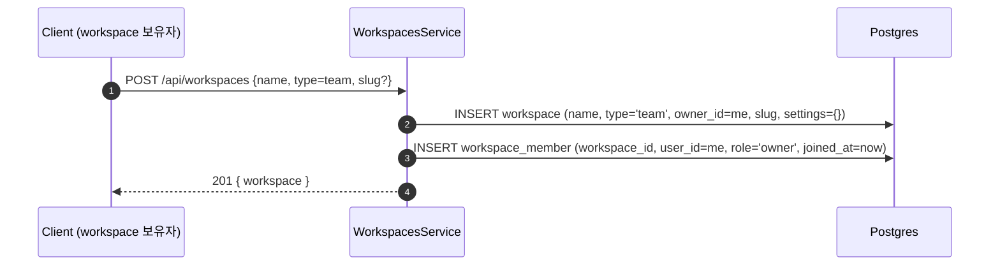
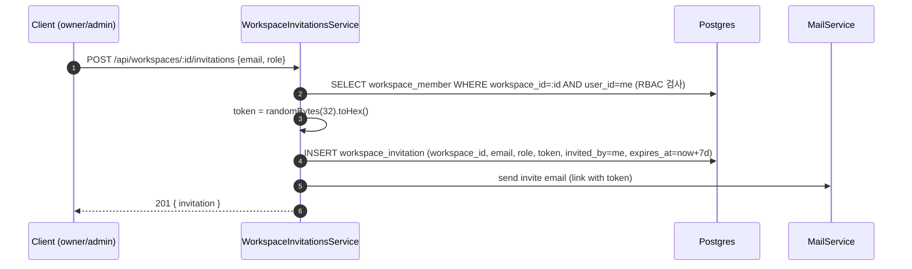
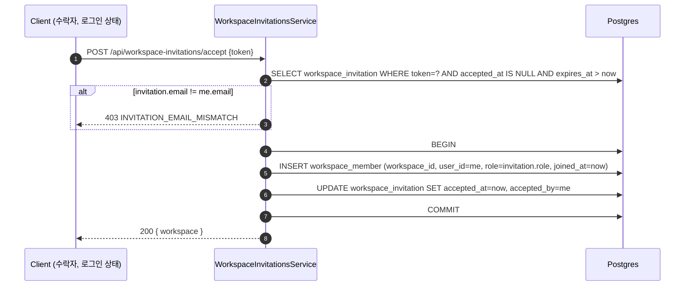
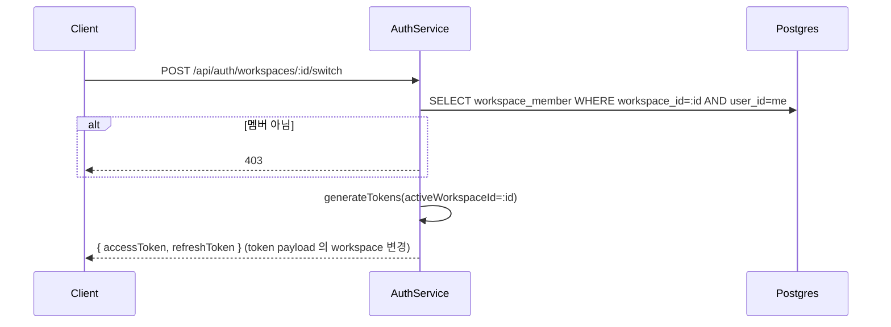
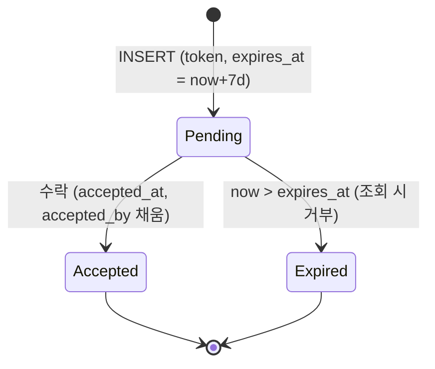

# Data Flow: 워크스페이스 (Workspace)

> 관련 spec: [Spec 인증 §1.5 초대 흐름](../5-system/1-auth.md) · [데이터 모델 §2.2~§2.3](../1-data-model.md) · [data-flow 개요](./0-overview.md)

---

## Overview

### System role

워크스페이스는 모든 리소스(워크플로우·통합·KB·LLM Config 등)의 격리 단위다. 사용자 1명은 1개의
personal workspace 를 가지며, 추가로 N개의 team workspace 에 멤버로 속할 수 있다. 멤버십은
`workspace_member` join 테이블이 N:M 관계를 표현하고, 새 멤버 초대는 토큰 기반 일회용 link 로 진행된다.

코드 진입점:

- `backend/src/modules/workspaces/workspaces.service.ts` — 워크스페이스 CRUD·멤버 관리
- `backend/src/modules/workspaces/workspace-invitations.service.ts` — 초대 발급·수락
- `backend/src/modules/workspaces/invitations.controller.ts` — `/api/workspaces/:id/invitations`

`X-Workspace-Id` 는 클라이언트 요청 헤더로 받지 않고 **서버가 access token 의 사용자에 대해 자동 매핑**
한다 (회원가입 시 personal workspace 가 default).

---

## 1. Source → Sink

### 1.1 워크스페이스 생성 (team)

### 1.2 멤버 초대 발급

### 1.3 초대 수락 (이미 가입한 사용자)

### 1.4 초대 수락 (미가입자 - 가입 + 합류)

상세 시퀀스는 `spec/5-system/1-auth.md §1.5.2`. 본 도메인 관점에서는 `auth.service.registerWithInvitation()`
경로가 다음을 단일 트랜잭션으로 수행:

1. `INSERT INTO "user"`
2. `INSERT INTO workspace + workspace_member` (personal)
3. `INSERT INTO workspace_member` (초대된 team workspace, `role=invitation.role`)
4. `UPDATE workspace_invitation SET accepted_at, accepted_by`

### 1.5 워크스페이스 전환

### 1.6 역할 변경 / 소유권 이전

| 액션 | 권한 | 동작 |
| --- | --- | --- |
| `PATCH .../members/:userId` `{role}` | owner / admin | `UPDATE workspace_member.role`. owner → admin 으로 강등은 owner 본인은 불가. |
| `POST .../transfer-ownership {newOwnerId}` | owner | 단일 트랜잭션으로 (1) 현 owner.role='admin', (2) new owner.role='owner', (3) `workspace.owner_id = newOwnerId`. |
| `DELETE .../members/:userId` | owner / admin | `DELETE workspace_member`. owner 본인은 불가. |

---

## 2. Schema 매핑

### 2.1 Postgres

| Sink (table) | 흐름 | read/write 컬럼 | 인덱스 / 제약 |
| --- | --- | --- | --- |
| `workspace` | 생성 | INSERT `name, type IN (personal/team), owner_id, slug, settings={}, created_at` | `slug UNIQUE`, `(owner_id, type) UNIQUE` (V001 + entity decorator) |
| `workspace` | 소유권 이전 | UPDATE `owner_id` | — |
| `workspace_member` | 가입·초대 수락 | INSERT `workspace_id, user_id, role IN (owner/admin/editor/viewer), invited_at, joined_at` | `(workspace_id, user_id) UNIQUE` |
| `workspace_member` | 역할 변경 | UPDATE `role` | — |
| `workspace_invitation` | 발급 | INSERT `workspace_id, email, role, token, invited_by, expires_at = now+7d, created_at` | `token UNIQUE` (V017), `(email)` idx, `(workspace_id)` idx |
| `workspace_invitation` | 수락 | UPDATE `accepted_at, accepted_by` | — |

### 2.2 외부

| Sink | 흐름 | 비고 |
| --- | --- | --- |
| SMTP | 초대 메일 발송 | `MailService.sendInvitationEmail`. SMTP 설정은 시스템 전역 (`spec/5-system/1-auth.md` Rationale 1.5.B) |

---

## 3. 상태 전이

### 3.1 `workspace_invitation.accepted_at`

### 3.2 RBAC 매트릭스 (요약)

| Role | 워크스페이스 설정 | 멤버 관리 | 워크플로우 CRUD | 실행 | LLM Config / Integration |
| --- | --- | --- | --- | --- | --- |
| owner | ✓ | ✓ (자기 외) | ✓ | ✓ | ✓ |
| admin | ✓ | ✓ (owner 제외) | ✓ | ✓ | ✓ |
| editor | ✗ | ✗ | ✓ | ✓ | view |
| viewer | ✗ | ✗ | view | ✓ (수동 실행 only) | view |

> 정식 권한 매트릭스는 `spec/5-system/1-auth.md §3.2`. 본 표는 데이터 변경 권한 관점의 요약이다.

---

## 4. 외부 의존

| 의존 | 방향 | 참고 |
| --- | --- | --- |
| Auth 도메인 | cross-ref | 회원가입 시 personal workspace 자동 생성. token payload 에 `activeWorkspaceId` 포함. [`auth.md`](./auth.md) |
| Mail 도메인 | 내부 → 외부 | 초대 메일 SMTP |
| Audit 도메인 | cross-ref | `workspace.*` 액션은 `audit_log` 적재. [`audit.md`](./audit.md) |

---

## Rationale

### `X-Workspace-Id` 헤더를 받지 않는 이유

클라이언트가 보내는 헤더로 받으면 token 의 `workspaceId` 와 헤더가 불일치하는 공격 경로가 생긴다.
서버는 access token payload 의 `activeWorkspaceId` 를 단일 진실로 사용하고, "다른 워크스페이스로
전환" 은 새 토큰 발급으로 표현한다 (§1.5).

### `workspace_invitation.email` 일치 강제

수락 시 token 만 알면 누구나 수락할 수 있으면 안 된다. 수락자의 인증된 이메일이 초대 이메일과 일치해야
멤버로 합류한다 (§1.3 `INVITATION_EMAIL_MISMATCH`). 초대받지 않은 다른 사용자가 token 을 가로채도
이메일이 다르면 거부된다.

### `(owner_id, type) UNIQUE`

한 사용자가 personal 워크스페이스를 2개 이상 가질 수 없도록 entity decorator 와 V001 의 정합성 단에서
모두 강제한다. team 워크스페이스는 다수 보유 가능.
